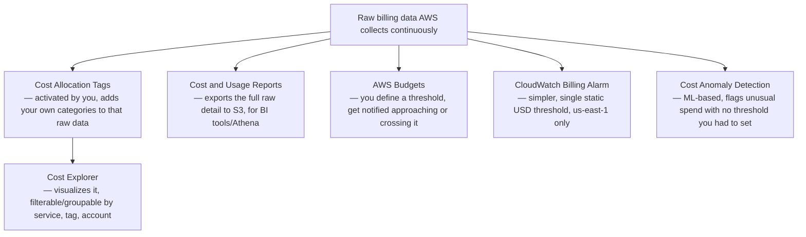

# 01 - AWS Billing & Cost Management

> Goal: understand that "Billing & Cost Management" isn't one single feature — it's a **suite** of related-but-distinct tools (Cost Explorer, Budgets, Cost and Usage Reports, Cost Allocation Tags, Cost Anomaly Detection, and CloudWatch Billing Alarms), each answering a genuinely different question about your spend. Knowing which tool answers which question is the actual exam skill here, more than any single console screen.

---

## 1. The core question each tool actually answers

| Tool | The question it answers |
|---|---|
| **Cost Explorer** | "Show me a visual breakdown of what I've *already* spent, by service/time/tag" |
| **AWS Budgets** | "Tell me *before or as* I cross a spending/usage threshold I define" |
| **CloudWatch Billing Alarms** | "Tell me the moment my actual month-to-date charges cross one specific dollar figure" |
| **Cost and Usage Reports (CUR)** | "Give me the complete, raw, line-item billing data export, for my own analysis tooling" |
| **Cost Allocation Tags** | "Let me break spend down by *my own* categories — project, team, environment — not just by AWS service" |
| **Cost Anomaly Detection** | "Automatically notice when my spending pattern suddenly looks *unusual*, without me defining a fixed threshold" |
| **Free Tier page** | "How close am I to exceeding the free usage limits I'm relying on as a learner?" |

---

## 2. Architecture & workflow — how these tools actually relate

Notice **Budgets** and **Billing Alarms** both notify you about spend crossing a line — they are genuinely two different, overlapping tools, not the same feature under two names. Section 5 below is dedicated entirely to telling them apart, since this exact confusion is a common exam trap.

---

## 3. Cost Explorer

A visual, interactive dashboard of spend **already incurred** — filter by service, linked account, Region, or (once activated) your own cost allocation tags; group by day/month; view historical trends. It also provides **Savings Plans and Reserved Instance recommendations**, based on your actual historical usage patterns.

> 🧠 Cost Explorer must be **enabled** before it shows data (a one-time toggle) — and creating your **first Budget automatically enables it for you** if you haven't already, per AWS's own current console behavior.

---

## 4. AWS Budgets — thresholds you define, with real flexibility

Budgets aren't just "cost" — there are four distinct **budget types**:

| Budget type | What it tracks |
|---|---|
| **Cost budget** | Total spend against a dollar amount you set |
| **Usage budget** | A usage metric (e.g. total EC2 hours), not dollars |
| **Savings Plans utilization/coverage budget** | Are you actually using the Savings Plans commitment you already bought? |
| **Reservation utilization/coverage budget** | Same idea, for Reserved Instances |

Two ways to create one:
- **Template (simplified)**: a single-page form with pre-built options — **Zero spend budget** (alerts the moment you exceed Free Tier limits — the natural choice while learning), **Monthly cost budget**, **Daily Savings Plans coverage budget**, **Daily reservation utilization budget**.
- **Custom (advanced)**: full control over every setting, including linked-account scoping and cost category filters.

> 🎯 A genuinely powerful, less-commonly-known feature: **Budget Actions** — a budget can be configured to automatically **apply an IAM policy, target an SNS topic, or stop/terminate EC2/RDS instances** the moment it's breached, not just send a notification. This turns a budget from a passive alert into an active cost-control guardrail.

---

## 5. Budgets vs. CloudWatch Billing Alarms — the exam-relevant distinction

| | AWS Budgets | CloudWatch Billing Alarm |
|---|---|---|
| **Can forecast?** | Yes — can alert on *projected* spend before you actually hit it | No — only reacts to **actual, already-incurred** charges crossing the line |
| **Granularity** | Rich — by service, account, tag, usage type, RI/Savings Plans coverage | One single, simple metric: `EstimatedCharges`, total account spend |
| **Setup location** | **Billing and Cost Management console**, any Region | **CloudWatch console**, and it **must** be set up in **`us-east-1`** — billing metric data is stored there regardless of where your actual resources run |
| **Prerequisite** | None beyond having a payer/root identity with billing access | Must first enable **"Receive CloudWatch Billing Alerts"** under Billing Preferences — a one-time, irreversible-to-disable opt-in |
| **Can trigger automated actions?** | Yes, via **Budget Actions** | No — notification only, via SNS |

> 🎯 **Exam tip**: "notify me the moment my account crosses $X in actual spend, and this must be built with CloudWatch" → **Billing Alarm, created in `us-east-1`**. "Notify me *before* I'm forecasted to exceed a monthly cost, broken down by team via tags" → **Budgets**. The `us-east-1`-only requirement for billing alarms is a specific, frequently tested detail — the same *shape* of regional gotcha the [Certificate Manager](../Security-Services/01-AWS-Certificate-Manager-ACM.md) note covered for CloudFront certificates, just for a completely different service.

---

## 6. Cost Allocation Tags

By default, Cost Explorer and CUR only break spend down by **AWS service** — not by *your own* meaningful categories (which team, which project, which environment). **Cost Allocation Tags** fix this:

1. Tag your resources normally (e.g. `Project: DevopsWithDeepak`, `Environment: Demo`).
2. **Activate** those specific tag keys in the Billing console — tags exist on resources automatically, but Cost Explorer/CUR only recognize ones you've explicitly turned on for cost tracking.
3. Wait — newly activated tags can take **up to 24 hours** to start appearing in cost data. This isn't instant.

There are two categories: **AWS-generated tags** (e.g. `aws:createdBy`, automatically applied) and **User-defined tags** (anything you tagged yourself) — both need this same activation step before they're usable for cost breakdowns.

---

## 7. Cost and Usage Reports (CUR) and Cost Anomaly Detection

- **CUR** is the "raw export" option — the most granular, line-item-level billing data AWS produces, delivered to an S3 bucket on a schedule, meant to be queried with tools like Amazon Athena or loaded into a BI tool. This is the answer whenever a scenario says "we need to build our own custom cost dashboards/analysis."
- **Cost Anomaly Detection** uses machine learning on your historical spend pattern to flag genuinely **unusual** charges — its entire value is that you don't have to guess and hand-set a fixed dollar threshold; it learns what "normal" looks like for your account and flags deviations from that.

---

## 8. The Free Tier page

A dedicated page in the Billing console tracking your account's actual usage against Free Tier limits, service by service — directly relevant while learning/practicing in a real AWS account, since it's the fastest way to confirm "am I still inside the free allowance" without cross-referencing Cost Explorer manually.

---

## 9. Recap

- "Billing & Cost Management" is a **suite**, not a single feature — Cost Explorer visualizes, Budgets proactively thresholds (with optional automated actions), Billing Alarms reactively threshold on actual spend only, CUR exports raw data, Cost Allocation Tags let you slice by your own categories, and Cost Anomaly Detection catches what you didn't think to set a threshold for.
- **Budgets can forecast; Billing Alarms cannot** — and Billing Alarms have a hard, specific `us-east-1` requirement regardless of where your resources actually run.
- **Cost Allocation Tags must be explicitly activated** and can take up to 24 hours to reflect in cost data — tagging a resource alone isn't enough.
- Next: the [Billing & Cost Management hands-on demo](01.01-Billing-Cost-Demo.md) — setting up a real budget, a real CloudWatch billing alarm, and activating a real cost allocation tag, end to end.

### Sources
- [What is AWS Billing and Cost Management? — AWS docs](https://docs.aws.amazon.com/cost-management/latest/userguide/billing-what-is.html)
- [Creating a budget — AWS docs](https://docs.aws.amazon.com/cost-management/latest/userguide/budgets-create.html)
- [Using a budget template (simplified) — AWS docs](https://docs.aws.amazon.com/cost-management/latest/userguide/budget-templates.md)
- [Create a billing alarm to monitor your estimated AWS charges — AWS docs](https://docs.aws.amazon.com/AmazonCloudWatch/latest/monitoring/monitor_estimated_charges_with_cloudwatch.html)
- [Using Cost Allocation Tags — AWS docs](https://docs.aws.amazon.com/cost-management/latest/userguide/activating-tags.html)
- [AWS Cost Anomaly Detection — AWS docs](https://docs.aws.amazon.com/cost-management/latest/userguide/manage-ad.html)
