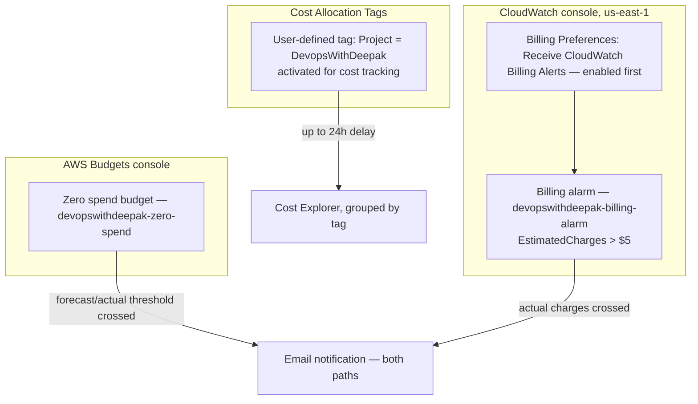

# 01.01 - Hands-On Demo: Real Budgets, Billing Alarms, and Cost Allocation Tags

> Goal: set up the two genuinely different "tell me when I'm spending too much" tools side by side — an **AWS Budget** and a **CloudWatch Billing Alarm** — so the difference from the [Billing & Cost Management](01-AWS-Billing-and-Cost-Management.md) note's Section 5 is something you've actually built, not just read about. Then activate a real **Cost Allocation Tag** and see it show up in Cost Explorer. Entirely via the **AWS Console**, no CLI.

---

## 1. What you're building

---

## 2. Step 1 — Create a Budget (template, simplified)

1. **Billing and Cost Management console** → left nav → **Budgets** → **Create budget**.
2. **Budget setup**: **Use a template (simplified)**.
3. **Templates**: **Zero spend budget** — a genuinely useful choice for a learning account, since it alerts the moment you exceed Free Tier limits at all, before any real charge accrues.
4. **Budget name**: leave the suggested name, or set it to `devopswithdeepak-zero-spend`.
5. **Email recipients**: enter your own email address.
6. **Create budget**.

> 🧠 If this is your **first** budget ever created in this account, AWS Budgets automatically enables **Cost Explorer** for you in the background at this point (the [Billing & Cost Management](01-AWS-Billing-and-Cost-Management.md) note's Section 3) — the Cost Explorer graph on this same page may show blank for up to 24 hours while that backfills.

---

## 3. Step 2 — Enable billing alerts (prerequisite for Step 4)

1. **Billing and Cost Management console** → left nav → **Billing Preferences**.
2. **Alert preferences** → **Edit**.
3. Check **Receive CloudWatch Billing Alerts**.
4. **Save preferences**.
5. Wait **~15 minutes** — AWS explicitly states billing data won't be visible/alarmable in CloudWatch immediately after enabling this.

> ⚠️ This preference **cannot be disabled again once turned on** (per AWS's own docs) — you can still delete individual billing alarms you create afterward, but the underlying metric collection itself stays on.

---

## 4. Step 3 — Create the CloudWatch billing alarm (`us-east-1` only)

1. **Switch the Region selector to `us-east-1` (N. Virginia)** — mandatory; billing metric data only exists there, worldwide, regardless of which Region your actual resources run in.
2. **CloudWatch console** → **Alarms** → **All alarms** → **Create alarm**.
3. **Select metric** → **Billing** → **Total Estimated Charge** → check **EstimatedCharges** → **Select metric**.
4. **Statistic**: **Maximum**. **Period**: **6 hours**.
5. **Threshold type**: **Static**. **Whenever EstimatedCharges is...**: **Greater**. **than...**: `5` (USD — a low, easy-to-reason-about number for a learning account; set this to whatever's actually meaningful for you).
6. **Additional configuration**: **Datapoints to alarm**: `1` out of `1`. **Missing data treatment**: **Treat missing data as missing**.
7. **Next** → **Notification**: **In alarm** selected → **Select an SNS topic** → **Create new topic** → name it `billing-alarm-topic` → enter your email as the topic's endpoint → **Create topic**.
8. **Check your email** and confirm the SNS subscription (a real, required step — the alarm can't notify you until this is confirmed).
9. **Next** → **Name**: `devopswithdeepak-billing-alarm` → **Next** → **Preview and create** → **Create alarm**.

---

## 5. Step 4 — Activate a Cost Allocation Tag

1. Tag an existing resource from anywhere else in this project (e.g. any EC2 instance still running, or an S3 bucket) with a key/value like `Project` = `DevopsWithDeepak`, if you haven't already tagged something similarly.
2. **Billing and Cost Management console** → left nav → **Cost Allocation Tags**.
3. **User-defined cost allocation tags** tab → find `Project` in the list → check its box → **Activate**.
4. This can take **up to 24 hours** to actually start appearing as a groupable dimension in Cost Explorer — this isn't a same-session result, and that's expected, not a sign anything went wrong.

---

## 6. Step 5 — Explore Cost Explorer

1. **Billing and Cost Management console** → left nav → **Cost Explorer**.
2. Default view shows cost by service over the last few months. Change **Group by** to **Tag** → select `Project` (once Step 4 has finished activating and propagating) to see spend broken down by your own category instead of just by AWS service.
3. Compare this to the **Budgets** page's own built-in Cost Explorer preview graph from Step 1 — same underlying data, different framing (one is a threshold tool with a chart attached, the other is the dedicated exploration tool).

---

## 7. Step 6 — Confirm the two alert paths actually differ

Re-read this directly against what you just built, not just the [Billing & Cost Management](01-AWS-Billing-and-Cost-Management.md) note's Section 5 table:

- The **Budget** (Step 1) can notify you based on **forecasted** spend, before you actually cross it, and lives entirely in the Billing console.
- The **CloudWatch alarm** (Steps 3-4) only reacts to **actual, already-incurred** `EstimatedCharges`, needed a **separate opt-in** (Step 2) before it could even be created, and had to be built specifically in **`us-east-1`** — try switching to a different Region and searching for the same **Billing** namespace metric, and it won't be there.

---

## 8. Troubleshooting

| Symptom | Likely cause |
|---|---|
| `Billing`/`EstimatedCharges` metric doesn't appear when creating the CloudWatch alarm | Step 2 wasn't completed, the 15-minute wait hasn't elapsed yet, or you're not in `us-east-1` |
| Billing alarm never notifies you even though you're confident you've spent something | SNS subscription email (Step 4, Step 8) was never confirmed — an unconfirmed subscription silently receives nothing |
| Cost Explorer's **Group by Tag** doesn't show your tag as an option | The tag wasn't actually **activated** in Cost Allocation Tags (Step 4), or it's within the 24-hour propagation window |
| Budget's Cost Explorer preview graph stays blank for a long time | Expected for a **brand new** account/first budget — can take up to 24 hours the very first time Cost Explorer is enabled |

---

## 9. Cleanup

1. **CloudWatch console** (`us-east-1`) → **Alarms** → delete `devopswithdeepak-billing-alarm`.
2. **SNS console** (`us-east-1`) → delete the `billing-alarm-topic` topic.
3. **Billing and Cost Management console** → **Budgets** → delete `devopswithdeepak-zero-spend` (or leave it — a Zero Spend budget costs nothing to keep running and is genuinely useful to leave active on a learning account).
4. Cost Allocation Tags and the **Receive CloudWatch Billing Alerts** preference are not reversible/deletable individually — leaving them on has no downside, so there's nothing further to clean up there.

---

## 10. Recap

- **Budgets** and **CloudWatch Billing Alarms** are genuinely different tools that happen to overlap on "alert me about spend" — Budgets can forecast and live in the Billing console with no special opt-in; Billing Alarms are `us-east-1`-only, need an explicit one-time (and permanent) opt-in, and only react to actual charges.
- A **Zero spend budget** is a particularly good default for any learning/practice AWS account — it's specifically designed to catch "I exceeded Free Tier" before real charges pile up.
- **Cost Allocation Tags need explicit activation** and a real propagation delay (up to 24 hours) before they're usable in Cost Explorer — tagging the resource itself is necessary but not sufficient.
- This closes out the AWS Billing & Cost Management topic for this project.

### Sources
- [Creating a budget — AWS docs](https://docs.aws.amazon.com/cost-management/latest/userguide/budgets-create.html)
- [Create a billing alarm to monitor your estimated AWS charges — AWS docs](https://docs.aws.amazon.com/AmazonCloudWatch/latest/monitoring/monitor_estimated_charges_with_cloudwatch.html)
- [Using Cost Allocation Tags — AWS docs](https://docs.aws.amazon.com/cost-management/latest/userguide/activating-tags.html)
- [AWS Budgets Actions — AWS docs](https://docs.aws.amazon.com/cost-management/latest/userguide/budgets-controls.html)
