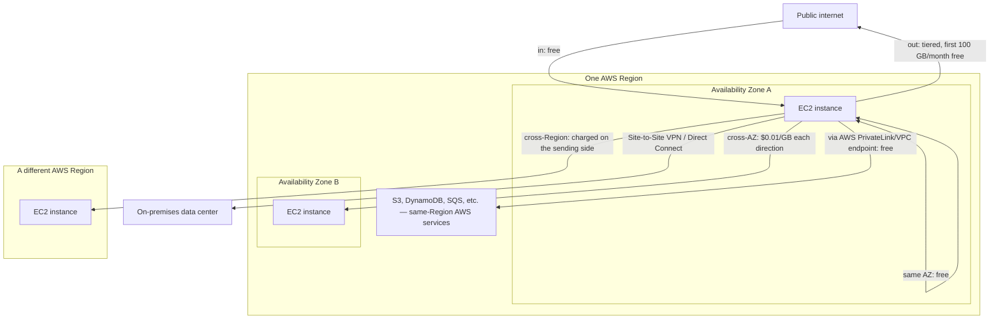

# 02 - Overview of AWS Data Transfer Costs

> Goal: build a working mental model for the single most commonly *miscalculated* part of an AWS bill — data transfer. The good news: it isn't random. Almost every rule below reduces to one question — **"is this data crossing a boundary AWS charges for — internet, Availability Zone, Region, or on-premises — and in which direction?"** Once that question becomes automatic, the actual dollar figures are just details to look up.

---

## 1. The mental model: direction and boundary, not volume, decide the price

Two things determine whether a byte of data transfer costs anything:

1. **Direction** — data moving **into** AWS (**"in"**) is essentially always **free**. Data moving **out** (**"out"** — to the internet, to another Region, sometimes to another Availability Zone) is where charges show up.
2. **Boundary crossed** — same Availability Zone (free) → same Region, different AZ (small per-GB charge) → different Region (charged, plus the receiving Region's own "in" side is free but the sending side is charged) → the public internet (charged, tiered, with a real free allowance).

> 🧠 **Simple analogy**: think of it like a toll road system where entering the city is always free, but tolls apply the farther out you drive — a short hop within your own neighborhood (same AZ) is free, crossing into the next neighborhood (cross-AZ) is a small toll, and driving all the way out of town (internet egress) is the most expensive stretch.

---

## 2. Architecture & workflow — where the toll gates actually sit

---

## 3. Data transfer between AWS and the internet

| Direction | Cost |
|---|---|
| **Data transfer IN from the internet** | **Free**, across all services, in all Regions |
| **Data transfer OUT to the internet** | Charged **per service**, at rates specific to the **originating Region** — but tiered, with a real free allowance |

**The current free-tier and tiered structure** (verified against AWS's own pricing page, not assumed):

| Tier | Rate |
|---|---|
| First **100 GB / month** (combined across all AWS services and Regions, except China and GovCloud) | **Free** |
| Next ~10 TB / month | **$0.09 / GB** |
| Next ~40 TB / month | **$0.085 / GB** |
| Next ~100 TB / month | **$0.07 / GB** |
| Beyond ~150 TB / month | **$0.05 / GB** |

> ⚠️ If you're studying from older material (including hand-drawn notes) that says **"first 1 GB / month free"** — that figure is outdated. AWS expanded the free data-transfer-out allowance to **100 GB/month, combined across all services and Regions**, back in November 2021, and it remains the current figure. This is exactly the kind of real-world drift worth catching rather than memorizing verbatim from an older course — the underlying *shape* of the pricing (tiered, cheaper at higher volume) is still exam-relevant; the specific "1 GB" number is not current.

---

## 4. Data transfer within the same AWS Region

| Scenario | Cost |
|---|---|
| Between EC2, RDS, Redshift, ElastiCache instances, and ENIs **in the same Availability Zone**, using private IPs | **Free** |
| **"In" and "out"** between EC2, RDS, Redshift, DynamoDB Accelerator (DAX), ElastiCache instances, ENIs, or VPC peering connections, **across Availability Zones in the same Region** | **$0.01/GB in each direction** |
| Direct transfer (via endpoints/APIs) between EC2 and S3, EBS direct APIs, S3 Glacier, DynamoDB, SES, SQS, Kinesis, ECR, SNS, or SimpleDB, **in the same Region** | **Free** |
| Traffic that passes through another AWS service in the path (PrivateLink endpoints, NAT Gateway, Transit Gateway) | You pay **that service's own data processing charge**, on top of any base transfer charge |
| "In" and "out" between EC2 instances and a Classic/Application Load Balancer, using **private IPs**, in the same VPC | **Free** |
| Data transferred "in"/"out" from a **public or Elastic IPv4** address | **$0.01/GB in each direction** |
| Data transferred "in"/"out" from an **IPv6** address **in a different VPC** | **$0.01/GB in each direction** |

> 🎯 **Exam tip**: "same AZ, private IP" is the only genuinely free path once you're inside a Region. The moment a **public/Elastic IP**, a **different AZ**, or a **different VPC over IPv6** enters the picture, a small per-GB charge applies even though everything is still technically "in the same Region."

---

## 5. Data transfer across AWS Regions

- If workload components communicate **across multiple Regions** using **VPC peering** or **Transit Gateway**, additional data transfer charges apply on top of standard inter-Region rates.
- If VPCs are peered **across Regions**, standard inter-Region data transfer charges apply — cross-Region traffic is never free, unlike same-Region private-IP traffic.

---

## 6. Data transfer between AWS and on-premises data centers

| Path | Cost |
|---|---|
| **AWS Site-to-Site VPN** — connection | **$0.05/hour** per standard (1.25 Gbps) connection |
| **AWS Site-to-Site VPN** — data transferred out | Standard tiered internet data-transfer rates apply (Section 3's table) — the first 100 GB/month free allowance applies here too |
| **Site-to-Site VPN connected to a Transit Gateway** | Transit Gateway's own **$0.05/hour per VPC attachment**, plus **$0.02/GB** data processing, plus **$0.02/GB** for traffic across peering attachments |
| **AWS Direct Connect** — data **into** AWS | **$0.00/GB**, in all Direct Connect locations |
| **AWS Direct Connect** — data **out** of AWS | Depends on the **source Region** and the **Direct Connect location/provider** — not a single flat rate |
| **Direct Connect connected to a Transit Gateway** | Same Transit Gateway hourly-per-attachment and data-processing charges as the VPN case above |

> 🧠 Notice the pattern repeats: **inbound to AWS is free, outbound is charged**, whether the "outside" is the public internet or your own data center over VPN/Direct Connect. Direct Connect's appeal isn't that it's free both ways — it's that it avoids the public internet entirely and often offers better, more predictable rates and reliability for the outbound side.

---

## 7. General cost-reduction tips (the exam's favorite "best practice" answers)

1. **Use VPC endpoints** (Gateway or Interface/PrivateLink) to avoid routing traffic over the public internet when connecting to AWS services from within AWS.
2. **Use Direct Connect instead of the public internet** for large, sustained volumes of data sent to on-premises networks.
3. **Stay within a single Availability Zone** for tightly-coupled resources whenever latency/design allows — crossing an AZ boundary typically incurs a charge, even inside one Region.
4. **Avoid unnecessary cross-Region traffic** — crossing a Regional boundary almost always costs more than crossing an AZ boundary; only do it when the architecture genuinely requires it (e.g. disaster recovery, global replication).
5. **Use the AWS Free Tier** deliberately while learning — under the right conditions, a workload can be tested at effectively zero data-transfer cost.
6. **Use the AWS Pricing Calculator** to estimate data transfer costs for a specific solution before building it, rather than discovering the number on the bill.
7. **Use a cost-visualization dashboard** (Cost Explorer, grouped by the `Usage Type` dimension) to actually see where data transfer charges are concentrated — this is often the single largest "hidden" line item on a bill, precisely because no one resource looks expensive on its own.

---

## 8. Recap

- The two questions that decide almost every data-transfer charge: **which direction** (in is free, out is charged) and **what boundary is crossed** (AZ, Region, internet, on-premises).
- **Same-AZ, private-IP traffic is the only fully free path** once you're inside AWS — cross-AZ, public/Elastic IP, and cross-VPC IPv6 traffic all pick up a small **$0.01/GB** charge even within one Region.
- The current internet-egress free allowance is **100 GB/month, combined across all services and Regions** — a meaningfully larger, and more current, number than the "1 GB free" figure some older material still shows.
- **Direct Connect data transfer IN is always free**; both Direct Connect and Site-to-Site VPN still charge for data going **out**, following the same tiered internet-egress rates.
- VPC endpoints, Direct Connect, and staying within an AZ/Region whenever the architecture allows are the exam's recurring "how do we reduce this" answers.
- This closes out the [AWS Billing & Cost Management](01-AWS-Billing-and-Cost-Management.md) topic for this project — data transfer is billed and reported through the same Cost Explorer/CUR/Budgets tooling that note covered, just against its own distinct `Usage Type` cost dimension.

### Sources
- [Amazon EC2 On-Demand Pricing — Data Transfer — AWS](https://aws.amazon.com/ec2/pricing/on-demand/#Data_Transfer)
- [AWS Free Tier — data transfer expansion to 100 GB/month — AWS News Blog](https://aws.amazon.com/blogs/aws/aws-free-tier-data-transfer-expansion-100-gb-from-regions-and-1-tb-from-amazon-cloudfront-per-month/)
- [AWS Site-to-Site VPN Pricing — AWS](https://aws.amazon.com/vpn/pricing/)
- [AWS Transit Gateway Pricing — AWS](https://aws.amazon.com/transit-gateway/pricing/)
- [AWS Direct Connect Pricing — AWS](https://aws.amazon.com/directconnect/pricing/)
- [Overview of Data Transfer Costs for Common Architectures — AWS Whitepaper](https://docs.aws.amazon.com/whitepapers/latest/aws-overview/network-services.html)
