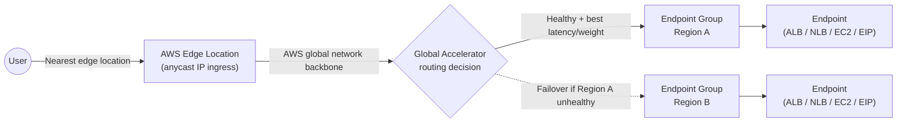

# 02 - Introduction Of AWS Global Accelerator

> Goal: learn the actual building blocks of Global Accelerator — accelerator, listener, endpoint group, endpoint — and trace exactly how a request travels through them onto AWS's global network.

---

## 1. The four components

| Component | What it is |
|---|---|
| **Accelerator** | The top-level resource. Gets **2 static anycast IP addresses** (or your own IPs via BYOIP) that never change, regardless of what's behind them or which Regions are added/removed later. |
| **Listener** | Defines which **protocol(s) and port range(s)** the accelerator processes (TCP, UDP, or both). |
| **Endpoint group** | One per **AWS Region**. Holds the region's endpoints, a **traffic dial** (0-100%, Note 03), and region-level health-check settings. |
| **Endpoint** | The actual target: an **ALB**, **NLB**, **EC2 instance**, or **Elastic IP address** — each with an assigned **weight** (Note 03) controlling its share of traffic within the group. |

> 🧠 **Mental model:** it nests the same way CloudFront's origin model does — `Accelerator → Listener → Endpoint Group (per Region) → Endpoint`, mirroring `Cloudfront_CDN`'s `Distribution → Cache Behavior → Origin`, just organized by **Region** instead of by **path pattern**.

---

## 2. How a request actually flows

1. A user's traffic, addressed to one of the accelerator's **static anycast IPs**, automatically ingresses at whichever **AWS edge location is geographically nearest to that user** — this is what "anycast" means: the same IP address is announced from many locations, and standard internet routing (BGP) sends the user to the nearest one.
2. From that edge location onward, traffic travels over **AWS's own private global network backbone**, not the public internet, all the way to the selected endpoint.
3. Global Accelerator picks **which Region's endpoint group** handles the request based on **configured traffic dials, endpoint health, and geographic proximity** — and does this **per connection**, not via DNS, so there's no client-side TTL/caching delay when a Region's health status changes (Note 01, Section 3).

---

## 3. Static IPs and why they matter

- A standard accelerator gets **exactly 2 static anycast IPv4 addresses** by default (dual-stack/IPv6 support is also available).
- These IPs **never change** for the lifetime of the accelerator, even if you add/remove Regions, swap load balancers, or completely rebuild the backend infrastructure behind them.
- This makes them ideal for **firewall allow-listing** on the client side — a corporate client can allow-list your two fixed IPs once, and your infrastructure is free to evolve behind them indefinitely without ever asking that client to update a firewall rule again.

> 🎯 **Exam tip:** "customers need to allow-list a fixed IP in their firewall, but our backend infrastructure changes frequently" is a strong, specific Global Accelerator signal — a CloudFront distribution domain name or an ALB's DNS name don't give you this fixed-IP guarantee.

---

## 4. Recap

- Global Accelerator is built from four nested components: **Accelerator** (static anycast IPs) → **Listener** (protocol/port) → **Endpoint Group** (per Region) → **Endpoint** (ALB/NLB/EC2/EIP).
- Traffic ingresses at the **nearest AWS edge location** to the user via anycast, then travels the rest of the way over **AWS's private backbone**, not the public internet.
- The **2 static anycast IPs** never change, making them ideal for client-side firewall allow-listing even as backend infrastructure evolves.
- Next: Note 03 — Key Features Of AWS Global Accelerator, covering traffic dials, endpoint weights, health checks, client affinity, and Standard vs. Custom Routing accelerators.

### Sources
- [AWS Global Accelerator components — AWS docs](https://docs.aws.amazon.com/global-accelerator/latest/dg/introduction-components.html)
- [How AWS Global Accelerator works — AWS docs](https://docs.aws.amazon.com/global-accelerator/latest/dg/introduction-how-it-works.html)
- [AWS Global Accelerator features](https://aws.amazon.com/global-accelerator/features/)
