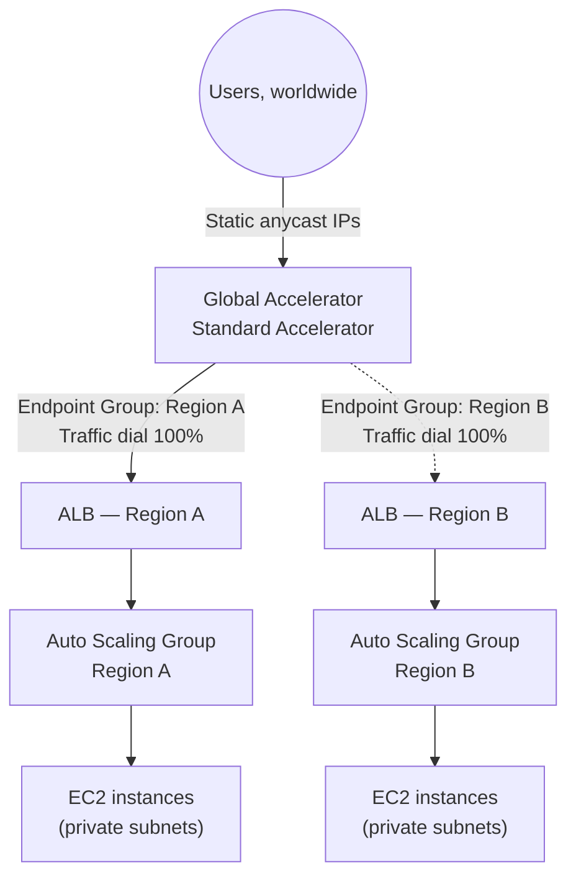

# 05 - AWS Global Accelerator - Super Lab Introduction

> Goal: lay out the full architecture the next three parts (Notes 06-08) build step by step — a production-shaped, two-Region, highly available setup with Global Accelerator sitting in front of a real Application Load Balancer + Auto Scaling Group in each Region, replacing Note 04's single bare EC2 instances.

---

## 1. Why go beyond Note 04's simple lab

Note 04 proved the core routing/failover behavior using one bare EC2 instance per Region — enough to see the mechanism, but not representative of how Global Accelerator is actually deployed in production. Real workloads sit behind a **load balancer** and scale via an **Auto Scaling Group**, so a Region's "health" isn't one instance's health — it's the health of an entire elastic fleet, fronted by an ALB that Global Accelerator can health-check as a single endpoint.

---

## 2. Target architecture

- **Two full Regions**, each with its own VPC, public/private subnets, an **Application Load Balancer** in the public subnets, and an **Auto Scaling Group** of EC2 instances in the private subnets behind it (same pattern as this repo's `EC2/LoadBalancer` and `EC2/ASG` folders — Global Accelerator simply adds a Region-spanning front door on top).
- **One Global Accelerator**, Standard type, with **one listener** and **two endpoint groups** (one per Region), each pointing at that Region's **ALB** as its endpoint.
- Both endpoint groups dialed to **100%** traffic initially — Global Accelerator picks the best Region per request based on proximity and health, exactly as in Note 04, just with an ALB+ASG's health behind each endpoint instead of a single instance.

---

## 3. What each remaining part builds

| Part | Focus |
|---|---|
| **Note 06 (Part 1)** | Build the underlying regional infrastructure — VPC, subnets, security groups, ALB, and Auto Scaling Group — **in both Regions**, independently of Global Accelerator. |
| **Note 07 (Part 2)** | Create the **Global Accelerator** itself: listener, the two endpoint groups, and attach each Region's ALB as its endpoint. |
| **Note 08 (Part 3)** | **End-to-end verification** — confirm normal routing, force a Regional failure and observe failover, compare against Route 53 failover routing, and clean everything up. |

> 🧠 This progression mirrors `EC2/LoadBalancer`'s Gateway Load Balancer 3-part lab (Notes 15-17 there): build the supporting infrastructure first, wire up the star-of-the-show service second, then verify end-to-end and tear down last.

---

## 4. Recap

- The Super Lab replaces Note 04's bare EC2 instances with a **real ALB + Auto Scaling Group per Region**, giving a production-representative test of Global Accelerator's routing and failover behavior.
- Architecture: **Global Accelerator → per-Region endpoint group → ALB → Auto Scaling Group → EC2 instances**, in two separate Regions.
- Next: Note 06 — Super Lab Part 1, building the regional VPC/ALB/ASG infrastructure in both Regions.

### Sources
- [AWS Global Accelerator components — AWS docs](https://docs.aws.amazon.com/global-accelerator/latest/dg/introduction-components.html)
- [Application Load Balancers — AWS docs](https://docs.aws.amazon.com/elasticloadbalancing/latest/application/introduction.html)
- [Amazon EC2 Auto Scaling — AWS docs](https://docs.aws.amazon.com/autoscaling/ec2/userguide/what-is-amazon-ec2-auto-scaling.html)
