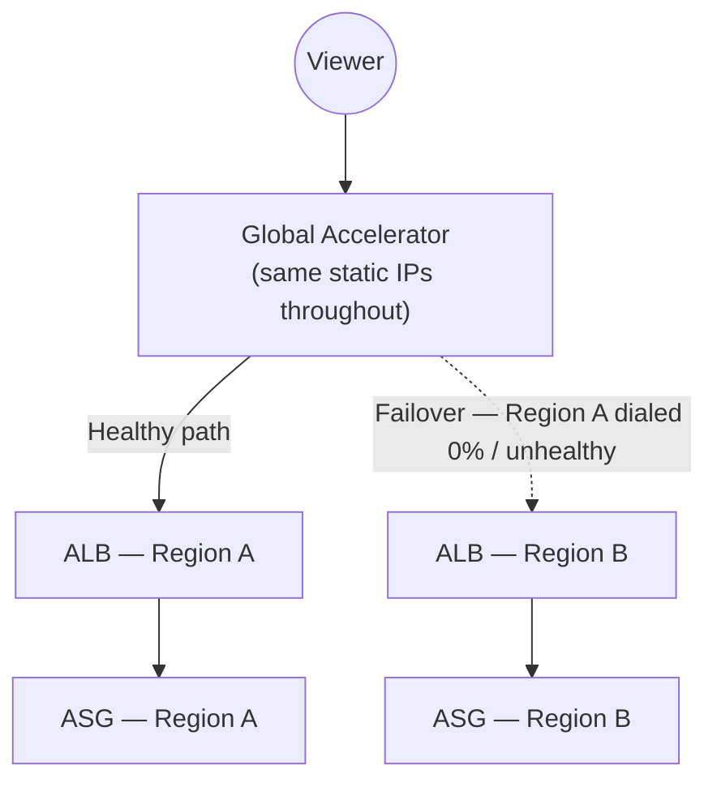

# 08 - AWS Global Accelerator - Super Lab Part 3

> Goal: prove the full architecture end-to-end — normal proximity-based routing, forced Regional failover, a direct comparison against Route 53 failover routing, and finally cleanup — closing out the Super Lab.

---

## 1. Verify normal routing through the accelerator

```bash
curl http://<accelerator-static-ip-1>/
```

- The response identifies whichever Region's ALB/ASG fleet Global Accelerator judged the best destination — proximity and health, per Notes 02-03.
- Run it repeatedly; since both endpoint groups are healthy and dialed at 100% (Note 07), responses should consistently favor the same (nearest/best) Region unless you're testing from a location roughly equidistant from both.

---

## 2. Force a Regional failure and observe failover

1. In **Region A**, either:
   - Set the endpoint group's **traffic dial to 0%** (a clean, deliberate way to simulate "take this Region out"), **or**
   - Manually terminate/stop enough instances in Region A's ASG (or detach the ALB's target group) to make its health checks fail, simulating a genuine outage.
2. Re-run:
   ```bash
   curl http://<accelerator-static-ip-1>/
   ```
3. Traffic should now consistently come from **Region B** — with the **same static IP**, no DNS change, and failover completing within roughly the health-check interval (well under Route 53's typical DNS TTL window).
4. Restore Region A (traffic dial back to 100%, or let the ASG self-heal) and confirm traffic distribution returns to normal.

---

## 2.1 Diagram: what just happened



---

## 3. Compare against Route 53 failover routing

If a Route 53 **failover routing policy** (`Route53` folder) were used instead of Global Accelerator here, the same Regional outage would require:

1. Route 53's own health check to detect the failure.
2. DNS resolvers **and clients** to stop using their **cached** answer — which persists until the record's **TTL** expires, potentially minutes, and is entirely outside AWS's control once a resolver has cached it.

> 🎯 **Exam tip:** this is the concrete, hands-on version of Note 01's core comparison — Global Accelerator's failover is a **routing decision made per-connection at the network layer**, while Route 53's is a **DNS answer that clients hold onto until TTL expiry**. A scenario explicitly needing failover **faster than DNS TTL allows** points at Global Accelerator, not Route 53 alone.

---

## 4. Clean up (in order)

1. Delete the **Global Accelerator** (releases the static IPs).
2. Delete both **Application Load Balancers** and their **target groups**.
3. Delete both **Auto Scaling Groups** (terminates their instances) and the **launch templates**.
4. Delete both **VPCs** (NAT Gateways, subnets, Internet Gateways, security groups) — remembering NAT Gateways incur hourly charges even when idle, so don't leave them running past the lab.

---

## 5. Recap

- Verified Global Accelerator's proximity-based routing and, more importantly, its **fast, network-layer failover** between two full Regional ALB/ASG stacks — using the traffic dial (clean simulated outage) or actual instance/target-group failure (realistic outage).
- The **same static IPs** served requests throughout the entire failover, with no DNS propagation delay — the direct, hands-on contrast against Route 53's TTL-bound failover routing.
- This closes the `AWS_Global_Accelerator` folder: Notes 01-03 covered concepts and features, Note 04 proved the mechanism with bare EC2 instances, and Notes 05-08 built and verified a full production-shaped, two-Region, ALB+ASG-backed architecture.

### Sources
- [Cross-Region DNS-based load balancing and failover — AWS whitepaper](https://docs.aws.amazon.com/whitepapers/latest/real-time-communication-on-aws/cross-region-dns-based-load-balancing-and-failover.html)
- [How AWS Global Accelerator works — AWS docs](https://docs.aws.amazon.com/global-accelerator/latest/dg/introduction-how-it-works.html)
- [Amazon Route 53 failover routing — AWS docs](https://docs.aws.amazon.com/Route53/latest/DeveloperGuide/routing-policy-failover.html)
