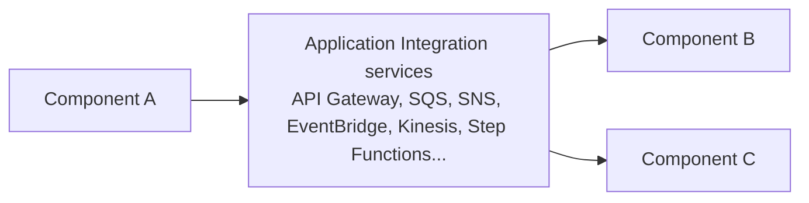

# 01 - AWS Application Integration - Introduction

> Goal: get a first, plain-language orientation to what "Application Integration" means as an AWS service category, before any individual service (API Gateway, SQS, SNS, EventBridge...) is introduced.

---

## 1. What "Application Integration" actually means

Once an application is built from more than one moving part — separate services, separate teams' code, separate systems entirely — those parts need a reliable way to exchange information. **Application Integration** is AWS's name for the family of managed services that provide exactly that: connecting decoupled application components without each one needing to know the internal details of the others.

> 🧠 **Simple analogy**: think of a company's internal mail system. A department doesn't need to know exactly where another department sits, or whether someone's on vacation — they just drop something in the mail system, and it's reliably delivered. AWS's Application Integration services are that internal mail system for software components.

---

## 2. Architecture & workflow — the category, at a glance

Each service in this category solves a different *shape* of the same underlying problem — direct request/response, queued work, broadcast notifications, event routing, or streaming data — and this folder covers each of them in turn.

---

## 3. Why this matters for the exam

The SAA-C03 exam frequently poses a scenario ("a service needs to process orders without losing any if a downstream system is temporarily unavailable," "notify multiple systems when a file is uploaded") and expects you to recognize which specific integration service fits — not just that "some AWS service" could technically work. Recognizing the category itself, and that it exists specifically to **decouple** components, is the first step toward picking the right specific tool.

---

## 4. Recap

- Application Integration is AWS's umbrella term for services that let decoupled application components communicate reliably.
- The core value is **decoupling** — components don't need direct knowledge of each other to exchange data.
- Next: the [Application Integration Basics](02-Application-Integration-Basic.md) note — going one level deeper into why this decoupling actually matters in practice.

### Sources
- [What Is Application Integration? — AWS Whitepaper](https://docs.aws.amazon.com/whitepapers/latest/aws-overview/application-integration-services.html)
- [AWS Application Integration services — AWS](https://aws.amazon.com/products/application-integration/)
