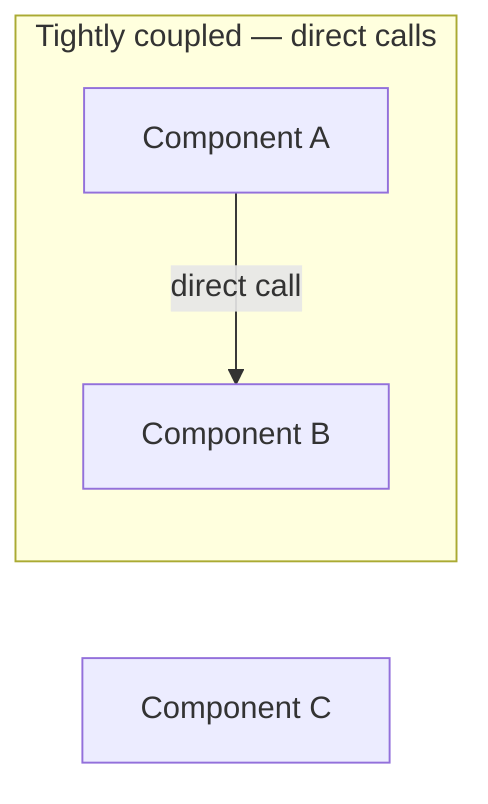
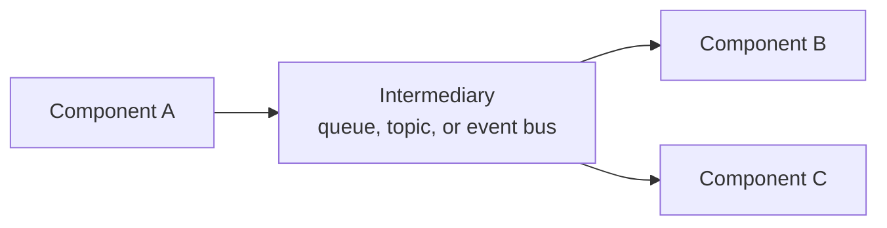

# 02 - Application Integration Basic

> Goal: understand the concrete problem that shows up the moment an application stops being one single program — tight coupling — and the basic pattern (an intermediary) that every service in this folder uses to solve it.

---

## 1. The problem: tight coupling makes systems fragile

If Component A calls Component B **directly**, several problems appear immediately:

- If B is down, A's request fails — right now, with no way to recover automatically.
- If B is slow, A is blocked waiting, even if A had other useful work it could be doing.
- If B needs to scale differently than A (e.g. B needs to run on 10 servers while A only needs 1), that's awkward when they're wired directly together.
- If a **second** component, C, also needs to know about A's activity, A now has to be modified to call C too.

---

## 2. Architecture & workflow — the basic fix: an intermediary

Instead of A calling B directly, A sends its message to an **intermediary** — a queue (SQS), a topic (SNS), or an event bus (EventBridge). B (and now C, without any change to A) reads from that intermediary whenever it's ready. A never needs to know B or C exist at all.

---

## 3. What this basic pattern actually buys you

| Benefit | Why it matters |
|---|---|
| **Fault tolerance** | If B is temporarily down, messages simply wait in the intermediary instead of failing outright |
| **Independent scaling** | A and B can scale on completely different schedules, since they're no longer directly tied together |
| **Extensibility** | Adding C as a new consumer doesn't require touching A's code at all |
| **Load leveling** | A sudden burst of activity from A gets smoothed out — B processes at its own sustainable pace, rather than getting overwhelmed instantly |

---

## 4. Recap

- Direct, tightly-coupled calls between components create fragility: one component's slowness or downtime directly impacts another.
- The basic fix, used throughout this folder, is inserting an **intermediary** (queue, topic, or event bus) between components.
- This buys fault tolerance, independent scaling, easy extensibility, and load leveling — the recurring justifications you'll see repeated for SQS, SNS, and EventBridge specifically.
- Next: the [Monolithic Architecture](03-What-Is-Monolithic-Architecture.md) note — the architectural starting point that made this decoupling need so much more pressing.

### Sources
- [What Is Application Integration? — AWS Whitepaper](https://docs.aws.amazon.com/whitepapers/latest/aws-overview/application-integration-services.html)
- [Decoupling patterns — AWS Prescriptive Guidance](https://docs.aws.amazon.com/prescriptive-guidance/latest/modernization-integrating-microservices/introduction.html)
