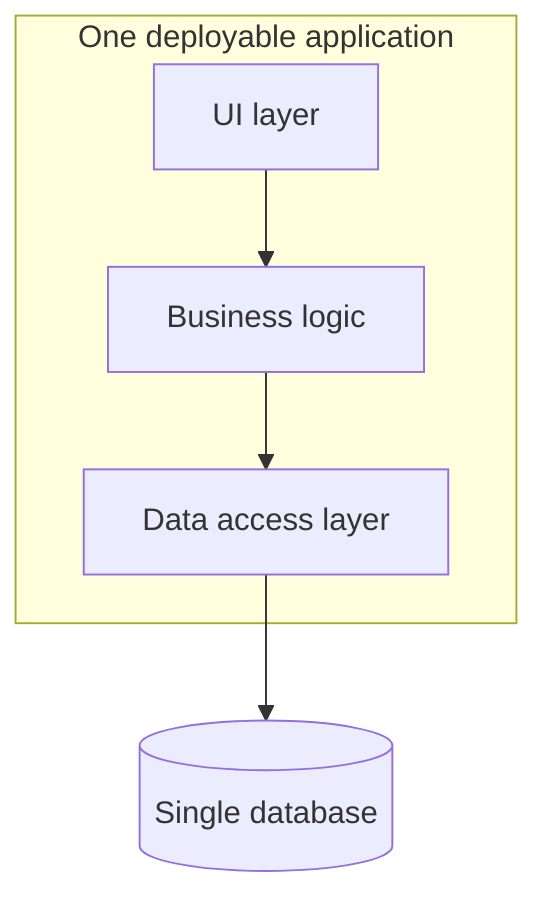

# 03 - What Is Monolithic Architecture?

> Goal: understand the monolithic architecture pattern on its own terms — including its genuine advantages — before contrasting it with microservices in the next note.

---

## 1. The core idea

A **monolithic architecture** packages an entire application — user interface, business logic, and data access — into **one single deployable unit**, running as one process (or one tightly-coupled cluster of identical processes). There's no internal network call between "the order logic" and "the payment logic" — it's all function calls within the same codebase.

> 🧠 **Simple analogy**: a monolith is like a single, all-in-one kitchen appliance that toasts, blends, and brews coffee — convenient to buy and set up as one unit, but if the toaster part breaks, you might lose the whole appliance, and you can't upgrade just the blender independently.

---

## 2. Architecture & workflow

---

## 3. Genuine advantages — this isn't just "the old bad way"

- **Simpler to develop initially** — one codebase, one set of tests, one deployment pipeline.
- **Simpler to reason about** — a function call within one process is easier to trace than a network call to a separate service.
- **No network overhead between internal components** — everything happens in-process, which can genuinely be faster for tightly-coupled logic.
- **Easier local development** — running "the whole application" often just means running one thing.

---

## 4. Where it genuinely struggles at scale

- **Scaling is all-or-nothing** — if only the "checkout" part of an e-commerce app is under heavy load, you still have to scale the *entire* application, including parts that don't need it.
- **One bug can affect everything** — a memory leak or crash in one part of the codebase can bring down the whole application, not just the feature that has the bug.
- **Deployment risk grows with size** — every deployment ships the entire application at once, even for a change to one small feature, increasing the blast radius of any single deployment.

> 🎯 **Exam tip**: a scenario describing an application that's becoming hard to scale, hard to deploy safely, or where one team's change frequently breaks unrelated features is describing the *symptoms* of an outgrown monolith — the expected direction of the answer is typically toward microservices and the decoupling services (SQS/SNS/EventBridge) that support them.

---

## 5. Recap

- A monolith bundles an entire application into one deployable unit — genuinely simpler to build and reason about, especially early on.
- Its core limitation is that scaling, deployment risk, and failure blast radius are all **all-or-nothing**, tied to the whole application at once.
- Next: the [Microservices Architecture](04-What-Is-Microservices-Architecture.md) note — the architectural response to exactly these limitations.

### Sources
- [What is a monolithic architecture? — AWS docs](https://docs.aws.amazon.com/whitepapers/latest/build-modern-applications-cdk/monolithic-architecture.html)
- [Monolithic vs Microservices — AWS](https://aws.amazon.com/microservices/)
