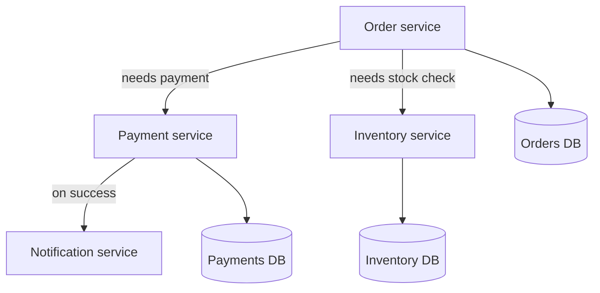

# 04 - What Is Microservices Architecture?

> Goal: understand microservices as the direct architectural response to the [Monolithic Architecture](03-What-Is-Monolithic-Architecture.md) note's scaling and blast-radius limitations — and be honest about the real operational cost it introduces in exchange.

---

## 1. The core idea

A **microservices architecture** splits an application into many small, **independently deployable** services, each owning a specific piece of business capability — an "order service," a "payment service," an "inventory service" — each with its own codebase, its own deployment pipeline, and often its own database.

> 🧠 **Simple analogy**: instead of one all-in-one kitchen appliance (the monolith), this is a full kitchen of separate, specialized tools — a toaster, a blender, a coffee maker — each replaceable, upgradable, and repairable independently, but now you need counters, plugs, and organization to make them all work together.

---

## 2. Architecture & workflow

---

## 3. What microservices genuinely solve

| Problem in a monolith | How microservices fix it |
|---|---|
| Scale the whole app to handle one hot feature | Scale **only** the specific service under load |
| One bug can crash everything | A failing service degrades its **own** functionality; ideally, the rest keep working |
| Every deploy risks the whole application | Each service **deploys independently** — smaller blast radius per change |
| Locked into one tech stack | Each service can pick the language/database that fits it best |

---

## 4. The real cost — this is not a free upgrade

Microservices trade monolith problems for a genuinely different, real set of operational challenges:

- **Network calls replace function calls** — now inherently slower, and can fail in ways an in-process call never could.
- **Distributed data** — no single database transaction spans multiple services cleanly anymore; consistency has to be handled deliberately.
- **Many more moving parts to monitor, deploy, and secure** — this is precisely why this project's [Monitoring](../Monitoring/01-Amazon-CloudWatch-Introduction.md) folder and this Application Integration folder both exist as large, dedicated topics.

> 🎯 **Exam tip**: this is exactly why AWS Application Integration services (SQS, SNS, EventBridge, API Gateway) matter so much on the exam — they're the managed tools that make the "real cost" bullet points above manageable, rather than something you'd have to build and operate yourself.

---

## 5. Recap

- Microservices split an application into small, independently deployable services — solving the monolith's all-or-nothing scaling and deployment risk.
- The trade-off is real: network calls, distributed data consistency, and many more moving parts to operate.
- This is the direct reason the rest of this folder exists — AWS's Application Integration services exist specifically to make microservices communication manageable.
- Next: the [Synchronous vs. Asynchronous](05-Synchronous-VS-Asynchronous.md) note — the key design decision for *how* those independent services actually talk to each other.

### Sources
- [Microservices on AWS — AWS](https://aws.amazon.com/microservices/)
- [Implementing microservices on AWS — AWS Whitepaper](https://docs.aws.amazon.com/whitepapers/latest/microservices-on-aws/microservices-on-aws.html)
