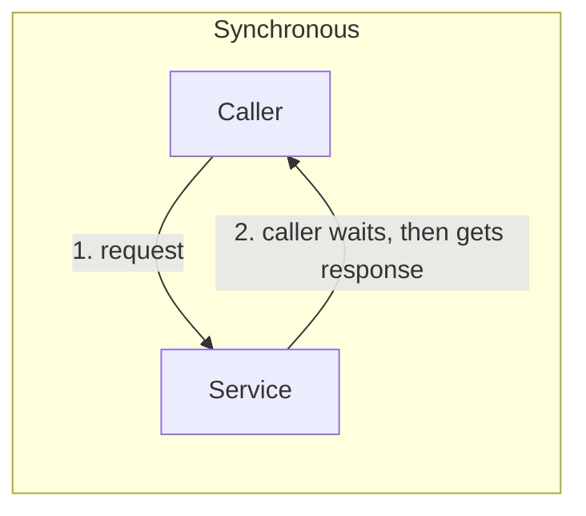
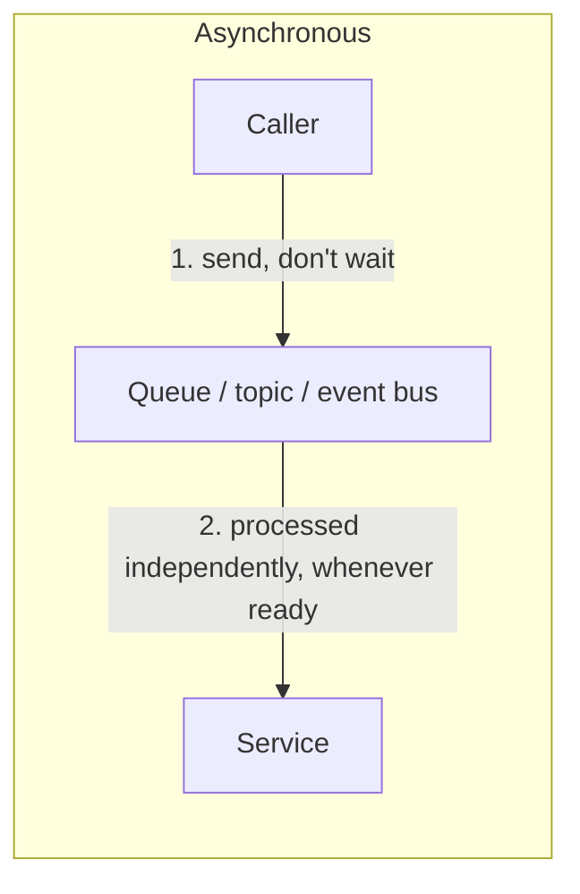

# 05 - Synchronous vs. Asynchronous

> Goal: nail down the single design decision that determines which AWS integration service actually fits a given problem — does the caller need an answer *right now*, or can the work happen *eventually*.

---

## 1. The core distinction

**Synchronous** communication means the caller sends a request and **blocks, waiting** for a response before doing anything else. **Asynchronous** communication means the caller sends its message and **immediately continues**, without waiting for the receiver to actually process it.

> 🧠 **Simple analogy**: a phone call is synchronous — you're both present, waiting on each other, in real time. A text message is asynchronous — you send it and go about your day; the other person replies whenever they get to it.

---

## 2. Architecture & workflow

---

## 3. Side-by-side

| | Synchronous | Asynchronous |
|---|---|---|
| **Caller behavior** | Blocks until a response arrives | Continues immediately after sending |
| **Coupling** | Tighter — both sides must be available at the same moment | Looser — the receiver can lag behind or be temporarily down |
| **Failure impact** | The caller feels the failure/slowness directly and immediately | An intermediary (queue/topic/bus) absorbs the failure — the message just waits |
| **Typical AWS service** | **API Gateway** request/response | **SQS**, **SNS**, **EventBridge** |
| **Good fit for** | "Is this payment authorized right now?" — needs an immediate answer | "Process this uploaded video," "send this order to fulfillment" — can tolerate a delay |

---

## 4. Recap

- **Synchronous**: caller waits for a response, tightly coupled to the receiver's availability right now.
- **Asynchronous**: caller sends and moves on; an intermediary absorbs timing and availability differences.
- This single distinction is the fastest way to eliminate wrong answers on an exam scenario — "needs an answer immediately" points synchronous/API Gateway; "can't lose work if downstream is unavailable," "handle bursts," "decouple" all point asynchronous.
- Next: the [Amazon API Gateway](06-API-Gateway.md) note — the primary AWS service for the synchronous side of this picture.

### Sources
- [Synchronous vs Asynchronous communication — AWS Prescriptive Guidance](https://docs.aws.amazon.com/prescriptive-guidance/latest/modernization-integrating-microservices/synchronous-asynchronous.html)
