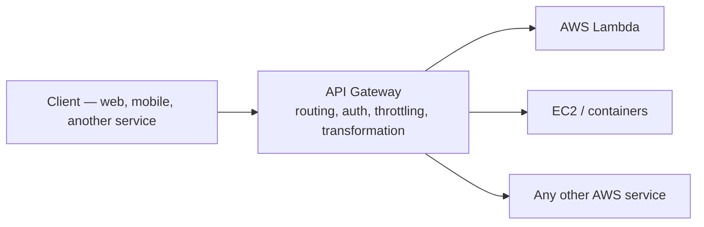

# 06 - API Gateway

> Goal: get a first, focused introduction to Amazon API Gateway itself — what it actually does as a managed "front door" — before the next notes get into REST vs. HTTP vs. WebSocket API specifics.

---

## 1. The problem: backends shouldn't handle raw client traffic directly

A Lambda function, an EC2-hosted service, or any backend generally shouldn't be exposed to the public internet directly — something needs to sit in front of it, handling routing, authentication, throttling, and request shaping before traffic ever reaches the actual application logic. **Amazon API Gateway** is AWS's fully managed answer: create, publish, secure, and monitor APIs at any scale, without running any of that infrastructure yourself.

---

## 2. Architecture & workflow

---

## 3. What API Gateway actually handles for you

| Responsibility | What it means in practice |
|---|---|
| **Routing** | Maps a URL path + HTTP method to a specific backend integration |
| **Authentication/authorization** | IAM, Lambda authorizers, or Cognito — enforced before the backend is even called |
| **Throttling** | Protects the backend from being overwhelmed by rate-limiting requests |
| **Transformation** | Reshapes requests/responses between what the client sends and what the backend expects |
| **Monitoring** | Automatic integration with CloudWatch metrics/logs for every API call |
| **Scaling** | Fully managed — no servers to provision, scales automatically with traffic |

---

## 4. Recap

- API Gateway is the managed front door in front of Lambda, EC2, or any other backend.
- It handles routing, auth, throttling, transformation, and monitoring so backend code doesn't have to.
- Next: the [REST API vs. HTTP API (Part 1)](07-REST-API-vs-HTTP-API-Part-1.md) note — choosing which specific API type actually fits.

### Sources
- [What is Amazon API Gateway? — AWS docs](https://docs.aws.amazon.com/apigateway/latest/developerguide/welcome.html)
