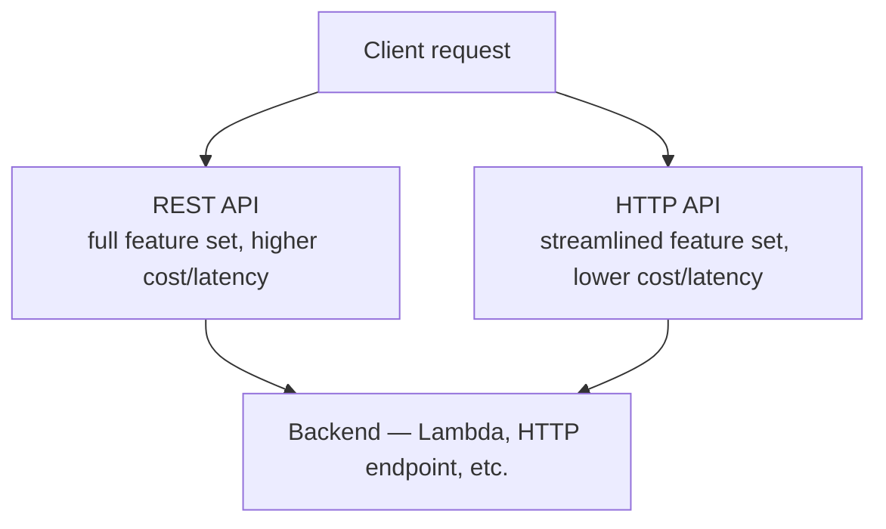

# 07 - REST API vs HTTP API (Part 1)

> Goal: start the REST-API-vs-HTTP-API comparison with the fundamentals — cost, latency, and history — before Part 2 goes deeper into feature-by-feature differences.

---

## 1. Two ways to build the same kind of API

Both **REST APIs** and **HTTP APIs** in API Gateway build ordinary request/response APIs — a client sends an HTTP request, a backend processes it, a response comes back. REST API is the **original**, more feature-rich API Gateway type; HTTP API is a **newer**, leaner type built specifically to be cheaper and faster for the common case.

---

## 2. Architecture & workflow

---

## 3. Cost and latency — the headline difference

| | REST API | HTTP API |
|---|---|---|
| **Price per million requests** | Roughly **$3.50** | Roughly **$1.00** — about **70% cheaper** |
| **Latency overhead** | Tens of milliseconds | Roughly **10ms** at p99 — meaningfully faster |

This gap exists because HTTP API was deliberately designed with a smaller feature set (covered in [Part 2](08-REST-API-vs-HTTP-API-Part-2.md)), which lets AWS run it more efficiently under the hood.

---

## 4. Why this matters for a real decision

> 🎯 **Exam tip**: AWS's own current guidance is to **start with HTTP API** for new request/response APIs — it covers the large majority of real-world use cases at meaningfully lower cost and latency. The decision to reach for REST API instead should be driven by a **specific missing feature**, not by habit or by REST API simply being the "original" option.

---

## 5. Recap

- REST API is the original, fuller-featured API Gateway type; HTTP API is newer, leaner, cheaper, and faster.
- HTTP API costs roughly 70% less per request and adds meaningfully less latency overhead.
- Next: the [REST API vs. HTTP API (Part 2)](08-REST-API-vs-HTTP-API-Part-2.md) note — the specific feature gaps that actually justify choosing REST API.

### Sources
- [Choose between REST APIs and HTTP APIs — AWS docs](https://docs.aws.amazon.com/apigateway/latest/developerguide/http-api-vs-rest.html)
- [Amazon API Gateway pricing — AWS](https://aws.amazon.com/api-gateway/pricing/)
