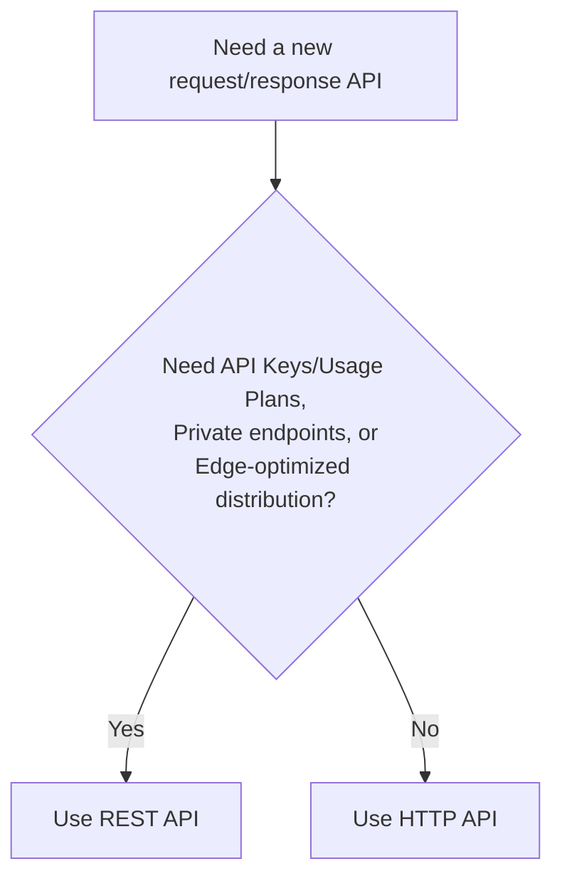

# 08 - REST API vs HTTP API (Part 2)

> Goal: finish the comparison from [Part 1](07-REST-API-vs-HTTP-API-Part-1.md) with the actual feature-by-feature breakdown — the specific, concrete reasons to reach for REST API instead of the cheaper, faster HTTP API.

---

## 1. Feature-by-feature comparison

| Feature | REST API | HTTP API |
|---|---|---|
| **API Keys & Usage Plans** | Supported | **Not supported** |
| **Per-client request throttling** | Supported | Limited |
| **Request validation** (reject malformed input at the edge) | Supported | Limited/not supported |
| **Private (VPC-only) endpoints** | Supported | Not supported |
| **Edge-optimized (CloudFront-backed) endpoints** | Supported | Not supported (HTTP APIs are Regional only) |
| **AWS WAF integration** | Supported | **Also now supported** (added in 2025) |
| **OIDC / OAuth 2.0 authorizers, native CORS, auto-deploy** | Supported, more manual to configure | Built in, simpler by default |

---

## 2. Architecture & workflow — deciding which type to use

---

## 3. Why WAF is no longer a REST-API-only advantage

Older material often lists **AWS WAF integration** as a REST-API-exclusive feature. That's genuinely outdated: AWS added native WAF support to HTTP APIs during 2025, closing what used to be one of the clearer reasons to pick REST API for security reasons alone. The remaining REST-API-only gaps — **API Keys/Usage Plans**, **private endpoints**, and **edge-optimized distribution** — are the ones still worth remembering as real differentiators.

> 🎯 **Exam tip**: if a scenario specifically mentions **API keys for metering usage by client**, or a **private, VPC-only API**, those are the clearest REST-API-required signals left. A scenario just mentioning "we need WAF protection" no longer automatically means REST API.

---

## 4. Recap

- The genuinely current REST-API-only features are **API Keys/Usage Plans**, **private endpoints**, and **edge-optimized distribution** — WAF support is no longer one of them.
- Absent one of those specific needs, HTTP API is both cheaper and faster, and is AWS's default recommendation.
- Next: the [WebSocket API](09-WebSocket-API.md) note — a third API type solving a fundamentally different problem than either of these.

### Sources
- [Choose between REST APIs and HTTP APIs — AWS docs](https://docs.aws.amazon.com/apigateway/latest/developerguide/http-api-vs-rest.html)
