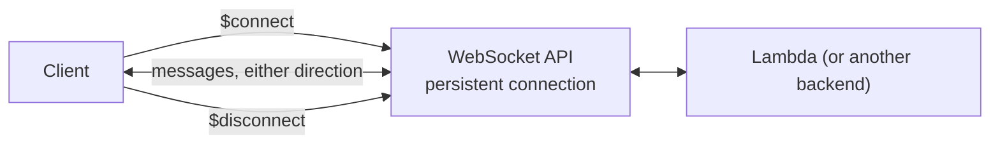

# 09 - WebSocket API

> Goal: understand WebSocket API as a genuinely different shape of API than REST/HTTP — not a pricier or cheaper variant of request/response, but a **persistent, bidirectional connection** model built for real-time use cases.

---

## 1. The problem: request/response can't let a server push data unprompted

With a REST or HTTP API, the client always initiates — it asks, the server answers, the connection closes. That model breaks down the moment the **server** needs to push data to the client without being asked first: a chat message arriving, a live dashboard updating, another player's move in a collaborative game. **WebSocket API** solves this by keeping a connection **open**, letting either side send messages at any time.

---

## 2. Architecture & workflow

---

## 3. The key building blocks

| Concept | What it is |
|---|---|
| **Connection ID** | A unique ID assigned to each open connection — backend code uses this to push a message back to a **specific** client later, even outside the original request |
| **Route key** | Determines how an incoming message is routed, extracted from the message content itself (e.g. a `"action"` field in a JSON message) |
| **`$connect` / `$disconnect` / `$default`** | Built-in special routes: `$connect` fires when a client opens the connection, `$disconnect` when it closes, `$default` catches any message that doesn't match another defined route |

---

## 4. Typical use cases

- **Chat applications** — messages pushed to all participants in real time.
- **Live dashboards** — metrics/updates streamed to a browser without polling.
- **Multiplayer/collaborative apps** — every participant's actions broadcast to everyone else immediately.

> 🎯 **Exam tip**: "the server needs to push updates to connected clients without the client repeatedly polling" is the clearest WebSocket API signal on the exam — REST/HTTP API simply can't do this at all, no matter how it's configured, since the client always has to initiate in that model.

---

## 5. Recap

- WebSocket API keeps a **persistent, bidirectional** connection open — a fundamentally different model than REST/HTTP's request-then-close.
- **Connection ID** lets backend code push a message to a specific client at any later time; **route keys** determine message routing, with `$connect`/`$disconnect`/`$default` as built-in special routes.
- Next: the [CRUD](10-What-Is-CRUD.md) note — back to REST/HTTP territory, covering the operation model most request/response APIs are actually built around.

### Sources
- [About WebSocket APIs in API Gateway — AWS docs](https://docs.aws.amazon.com/apigateway/latest/developerguide/apigateway-websocket-api-overview.html)
