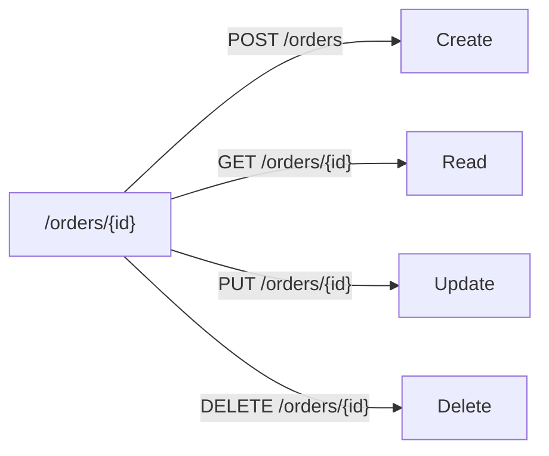

# 10 - What Is CRUD? Why Do We Use It In APIs?

> Goal: understand CRUD as the standard mental model behind most REST/HTTP APIs — why the same four operations show up on almost every resource, and how they map onto HTTP methods.

---

## 1. The core idea

**CRUD** stands for **C**reate, **R**ead, **U**pdate, **D**elete — the four basic operations almost any data-backed API needs to support for a given resource. Instead of inventing a unique action name for every operation, REST's convention is to map these four onto standard **HTTP methods**, applied to the **same resource path**.

---

## 2. Architecture & workflow

---

## 3. The mapping

| CRUD operation | HTTP method | Example |
|---|---|---|
| **Create** | `POST` | `POST /orders` — create a new order |
| **Read** | `GET` | `GET /orders/{id}` — fetch one order |
| **Update** | `PUT` (full replace) or `PATCH` (partial) | `PUT /orders/{id}` — replace an order's data |
| **Delete** | `DELETE` | `DELETE /orders/{id}` — remove an order |

---

## 4. Why this matters

- **Predictability** — once you know a resource is `/orders`, you already know roughly what each method on it should do, without reading custom documentation for every endpoint.
- **Consistency across an entire API** — every resource follows the same pattern, so client code (and API Gateway configuration) can be structured the same way everywhere.
- **Direct mapping to API Gateway Methods** — each CRUD operation becomes one **Method** on one **Resource** in API Gateway's own configuration model, covered in full detail once you get to that note.

> 🎯 **Exam tip**: a scenario describing "clients should be able to create, retrieve, update, and delete records via an API" is describing a straightforward CRUD API — the expected answer shape is a REST or HTTP API with one resource path and the four standard methods, not something more exotic.

---

## 5. Recap

- CRUD is the standard four-operation model — Create, Read, Update, Delete — that most data-backed APIs are built around.
- REST convention maps these cleanly onto `POST`/`GET`/`PUT`/`DELETE` on the **same** resource path, which is what makes REST APIs predictable to work with.
- This closes out the foundational API-type notes for this folder; next: the [API Gateway HTTP API Lab Introduction](11-API-Gateway-Lab-Introduction.md) — putting REST/HTTP/CRUD concepts into a real, hands-on build.

### Sources
- [Amazon API Gateway concepts — AWS docs](https://docs.aws.amazon.com/apigateway/latest/developerguide/api-gateway-basic-concept.html)
