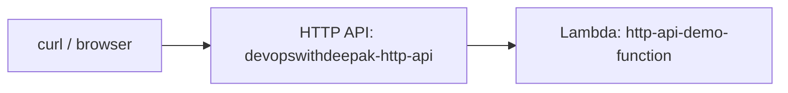

# 11 - API Gateway Lab Introduction

> Goal: preview what the next four parts (12-15) actually build — a real HTTP API backed by a real Lambda function — so each part's steps make sense in context before diving in.

---

## 1. What this lab builds, end to end

By the end of [Part 4](15-Part-4-Testing-Lab-Functionality.md), you'll have a working, publicly reachable HTTP endpoint that invokes a real Lambda function and returns a real JSON response — the smallest complete example of the [API Gateway](06-API-Gateway.md) note's "front door in front of Lambda" idea, built entirely through the **AWS Console**.

---

## 2. The four parts

| Part | What it covers |
|---|---|
| [Part 1 — Prerequisites](12-Part-1-Lab-Prerequisites.md) | Confirming console access and the IAM permissions the lab needs |
| [Part 2 — API Using Lambda](13-Part-2-API-Using-Lambda.md) | Creating the actual Lambda function the API will call |
| [Part 3 — Create API Gateway (HTTP API)](14-Part-3-Create-API-Gateway-HTTP-API.md) | Building the HTTP API and wiring it to that Lambda function |
| [Part 4 — Testing Lab Functionality](15-Part-4-Testing-Lab-Functionality.md) | Calling the real invoke URL and confirming it actually works |

---

## 3. Why this specific order

Notice the Lambda function is built **before** the API Gateway in Part 2 — this mirrors the real, practical order most engineers actually build in: get the backend logic working and testable on its own first, *then* put a front door in front of it. Trying to configure API Gateway before the Lambda function exists would just mean pointing at a target that isn't there yet.

---

## 4. Recap

- This lab builds one complete, working HTTP API + Lambda integration across four parts.
- The build order — Lambda first, then API Gateway — matches how this is done in practice, not just for teaching convenience.
- Next: [Part 1 — Lab Prerequisites](12-Part-1-Lab-Prerequisites.md).

### Sources
- [Setting up an HTTP API — AWS docs](https://docs.aws.amazon.com/apigateway/latest/developerguide/http-api-quick-start.html)
