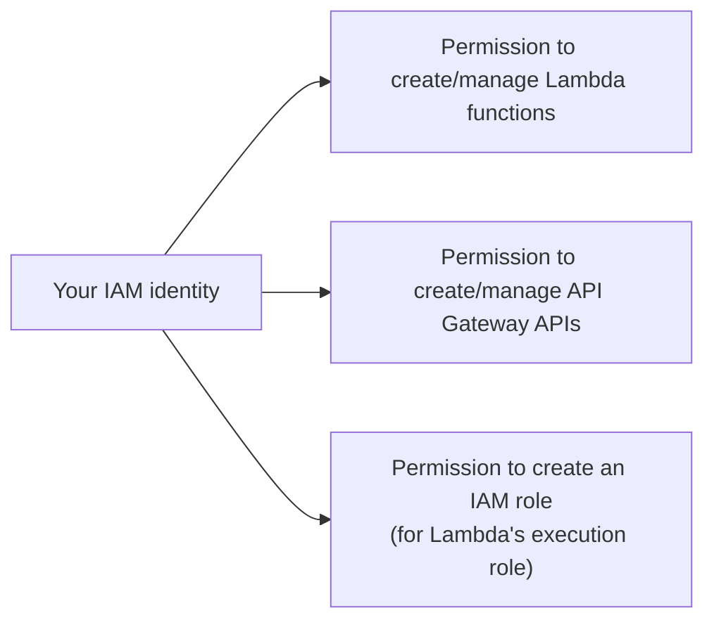

# 12 - Part-1 Lab Prerequisites

> Goal: confirm the account-level access this lab actually needs before touching Lambda or API Gateway — a short but genuinely useful check, since the most common reason a "simple" lab fails halfway through is a missing permission discovered late.

---

## 1. What this lab needs

---

## 2. Confirm access via the console

1. Sign in to the **AWS Management Console**.
2. Open the **Lambda console** → confirm you can see the **Create function** button without an access-denied banner.
3. Open the **API Gateway console** → confirm you can see the **Create API** button similarly.
4. Open the **IAM console** → **Roles** → confirm you can see **Create role** — this lab's Lambda function will need an execution role, which either you'll create explicitly or the console will offer to create automatically during function creation.

If your account is a fresh personal learning account (root user or an IAM user with `AdministratorAccess`), all of this is available by default with nothing further to configure.

---

## 3. Region

Pick one AWS Region to work in for this entire lab (e.g. `us-east-1` or `ap-south-1`) and stick with it across Parts 2-4 — Lambda functions and API Gateway APIs are Region-scoped, so mixing Regions partway through is the single most common avoidable mistake in a lab like this.

---

## 4. Recap

- This lab needs the ability to create Lambda functions, an IAM role, and an API Gateway API — all available by default on a standard admin-level learning account.
- Pick one Region and stay in it for the whole lab.
- Next: [Part 2 — API Using Lambda](13-Part-2-API-Using-Lambda.md).

### Sources
- [Setting up API Gateway — AWS docs](https://docs.aws.amazon.com/apigateway/latest/developerguide/setting-up.html)
