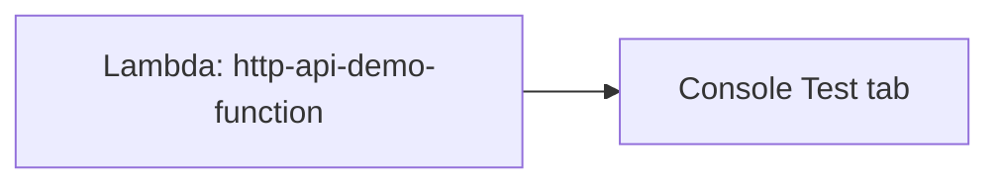

# 13 - Part 2: API Using Lambda

> Goal: build and test the actual backend logic — a real Lambda function — before any API Gateway configuration exists, continuing from [Part 1](12-Part-1-Lab-Prerequisites.md).

---

## 1. What you're building in this part



---

## 2. Step 1 — Create the function

1. **Lambda console** → **Create function** → **Author from scratch**.
2. **Function name**: `http-api-demo-function`.
3. **Runtime**: **Python 3.13**.
4. **Create function**.

---

## 3. Step 2 — Write the handler code

Replace the default code with:
```python
import json

def lambda_handler(event, context):
    return {
        "statusCode": 200,
        "headers": {"Content-Type": "application/json"},
        "body": json.dumps({
            "message": "Hello from DevopsWithDeepak's HTTP API demo",
            "path": event.get("rawPath"),
            "method": event.get("requestContext", {}).get("http", {}).get("method")
        })
    }
```
**Deploy**.

---

## 4. Step 3 — Test it directly, before any API Gateway involvement

1. **Test** tab → **Create new event** → **Event name**: `manual-test` → leave the default JSON body → **Test**.
2. Confirm a successful execution, returning the `statusCode`/`headers`/`body` structure from Section 3 — proof the function's logic itself works, independent of anything API Gateway will do later.

> 🧠 Testing the Lambda function on its own **before** wiring up API Gateway is a genuinely useful habit — if something breaks later, you'll already know the backend logic itself was fine, narrowing the problem to the API Gateway configuration specifically.

---

## 5. Recap

- The Lambda function was built and verified working entirely on its own, with no API Gateway involved yet.
- Its return shape (`statusCode`, `headers`, `body`) is deliberately already in the format a **Lambda proxy integration** expects — Part 3 will rely on this.
- Next: [Part 3 — Create API Gateway (HTTP API)](14-Part-3-Create-API-Gateway-HTTP-API.md).

### Sources
- [Building Lambda functions with Python — AWS docs](https://docs.aws.amazon.com/lambda/latest/dg/lambda-python.html)
- [Testing Lambda functions in the console — AWS docs](https://docs.aws.amazon.com/lambda/latest/dg/testing-functions.html)
