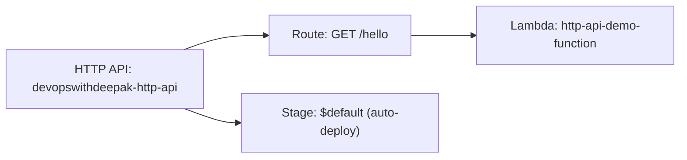

# 14 - Part 3: Create API Gateway (HTTP API)

> Goal: build the actual HTTP API and wire it to the `http-api-demo-function` Lambda function from [Part 2](13-Part-2-API-Using-Lambda.md), from the **API Gateway console** directly.

---

## 1. What you're building in this part

---

## 2. Step 1 — Create the API and its integration

1. **API Gateway console** → **Create API** → **HTTP API** → **Build**.
2. **Integrations** → **Add integration** → **Lambda** → select `http-api-demo-function`.
3. **API name**: `devopswithdeepak-http-api` → **Next**.

---

## 3. Step 2 — Configure the route

1. **Configure routes**: **Method**: `GET`, **Resource path**: `/hello`, **Integration target**: `http-api-demo-function` (already selected) → **Next**.

---

## 4. Step 3 — Configure the stage and create

1. **Configure stages**: leave the default **`$default`** stage with **Auto-deploy** enabled — this means every future change publishes automatically, no manual "deploy" step needed → **Next** → **Create**.

---

## 5. Step 4 — Confirm the permission was wired automatically

1. **Lambda console** → `http-api-demo-function` → **Configuration** → **Permissions** → **Resource-based policy statements**.
2. Confirm a new statement grants `apigateway.amazonaws.com` permission to invoke this function, scoped to the new HTTP API's ARN — API Gateway added this automatically the moment the integration was created in Section 2, with no manual IAM editing required.

---

## 6. Recap

- The HTTP API, its Lambda integration, and its route were all created directly from the API Gateway console — a different (and often clearer, for multi-route APIs) path than Lambda's own "+ Add trigger" shortcut used elsewhere in this project.
- The **`$default` stage with auto-deploy** means no separate deployment step is needed after this — a genuine HTTP API convenience over REST API's explicit deploy requirement, covered later in this folder.
- API Gateway automatically added the Lambda resource-based policy statement needed for invocation.
- Next: [Part 4 — Testing Lab Functionality](15-Part-4-Testing-Lab-Functionality.md).

### Sources
- [Setting up an HTTP API — AWS docs](https://docs.aws.amazon.com/apigateway/latest/developerguide/http-api-quick-start.html)
- [Working with AWS Lambda proxy integrations for HTTP APIs — AWS docs](https://docs.aws.amazon.com/apigateway/latest/developerguide/http-api-develop-integrations-lambda.html)
