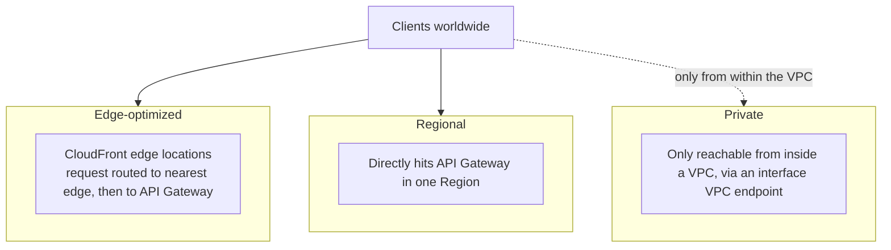

# 16 - REST API Endpoint Type

> Goal: understand the three places a REST API can actually terminate traffic — Edge-optimized, Regional, and Private — a genuinely REST-API-specific configuration choice with real, testable implications.

---

## 1. The problem: "where" an API physically answers requests matters

Two APIs with identical logic can behave very differently depending on **where** they actually terminate client connections — a globally distributed audience needs different handling than an internal-only service that should never touch the public internet at all.

---

## 2. Architecture & workflow

---

## 3. The three types

| Type | How it works | Best for |
|---|---|---|
| **Edge-optimized** | Requests route through **CloudFront's global edge network** before reaching API Gateway | Clients spread across many geographic regions — reduces latency for a globally distributed audience |
| **Regional** | Clients hit the API directly in a single Region, no CloudFront layer built in | Clients concentrated near that Region, or when you want your **own** CloudFront distribution/WAF in front instead of the built-in one |
| **Private** | Only reachable from **inside a VPC**, through an **interface VPC endpoint** — never reachable from the public internet | Internal-only backend services that must never be internet-exposed at all |

---

## 4. Recap

- **Edge-optimized**, **Regional**, and **Private** solve three genuinely different reachability problems, not three price tiers of the same thing.
- "Internal API, must never be reachable from the internet" → **Private**. "Global users, minimize latency" → **Edge-optimized**. "Want our own CDN/WAF layer" → **Regional**.
- Next: the [REST API TLS & Endpoint Security Policies](17-REST-API-TLS-Endpoint-Security-Policies.md) note — a related but distinct REST API custom-domain configuration.

### Sources
- [Choose an endpoint type to set up for an API Gateway API — AWS docs](https://docs.aws.amazon.com/apigateway/latest/developerguide/api-gateway-api-endpoint-types.html)
