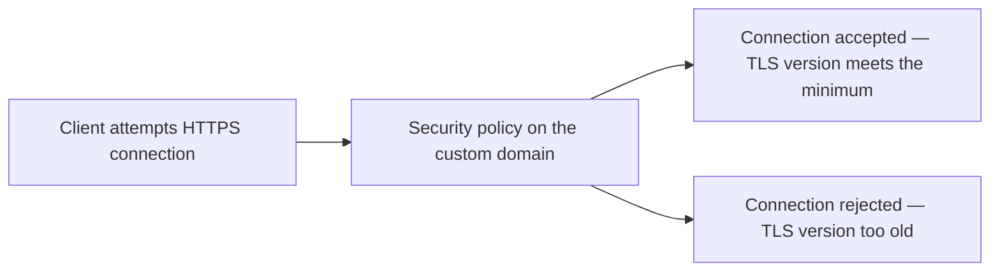

# 17 - REST API TLS & Endpoint Security Policies

> Goal: understand how a REST API's custom domain enforces a **minimum TLS version** — a specific, testable security policy setting distinct from the [endpoint type](16-REST-API-Endpoint-Type.md) covered in the previous note.

---

## 1. The problem: not every TLS version is still considered secure

TLS (the encryption protocol underlying HTTPS) has had multiple versions over the years, and older versions (like TLS 1.0) have known weaknesses. An API's custom domain needs a way to say "only accept connections using a genuinely secure handshake version" — that's what a **security policy** controls.

---

## 2. Architecture & workflow

---

## 3. The two security policies

| Security policy | Minimum TLS version accepted |
|---|---|
| **TLS 1.0** | Accepts TLS 1.0 and above — broader legacy client compatibility, weaker minimum security |
| **TLS 1.2** | Accepts only TLS 1.2 and above — the current recommended standard, rejecting older, weaker handshakes entirely |

This is set on a REST API's **custom domain name** configuration, and directly parallels the same TLS-handshake fundamentals covered in this project's [ACM note](../Security-Services/01-AWS-Certificate-Manager-ACM.md) — the security policy is simply *where* API Gateway enforces the minimum acceptable handshake version.

---

## 4. Recap

- A REST API custom domain's **security policy** sets the **minimum TLS version** it will accept — **TLS 1.2** is the current recommended baseline.
- This is a distinct setting from [endpoint type](16-REST-API-Endpoint-Type.md) — one controls *where* traffic terminates, the other controls *what encryption standard* is required to connect at all.
- Next: the [API Gateway Endpoint Access Mode - Strict Mode](18-API-Gateway-Endpoint-Access-Mode-Strict-Mode.md) note — closing a related but different gap in custom domain security.

### Sources
- [Choosing a minimum TLS version for a custom domain name — AWS docs](https://docs.aws.amazon.com/apigateway/latest/developerguide/apigateway-custom-domain-tls-version.html)
