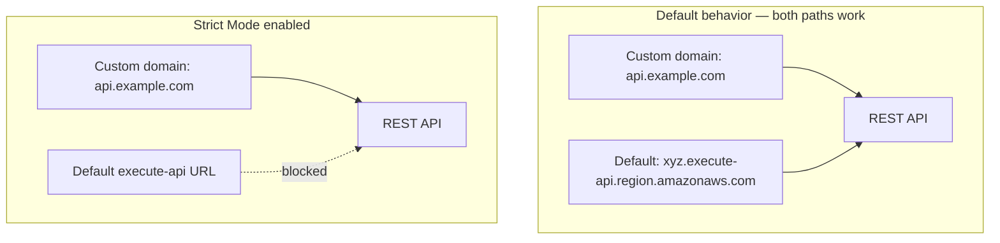

# 18 - API Gateway Endpoint Access Mode - Strict Mode

> Goal: understand a genuinely easy-to-miss gap — a REST API's default `execute-api` URL keeps working even after a custom domain is configured — and the setting (**Strict Mode**) that actually closes it.

---

## 1. The problem: the default URL doesn't disappear on its own

By default, when you configure a custom domain name for a REST API (e.g. `api.devopswithdeepak.site`), the original, auto-generated **execute-api endpoint** (`https://<api-id>.execute-api.<region>.amazonaws.com`) keeps working **side by side** with the new custom domain — nothing about adding a custom domain disables it.

---

## 2. Architecture & workflow

---

## 3. Why this is a real, non-obvious security gap

If a security control — a **WAF Web ACL**, an IP allow-list, or any policy — is attached only to traffic arriving through the **custom domain**, someone who discovers the raw `execute-api` URL (which isn't secret; it appears in console screens, logs, and often documentation) can simply call that URL directly and **bypass** those controls entirely, since they were never applied to that path.

---

## 4. The fix: Strict Mode

Enabling **Strict Mode** for endpoint access makes the API reachable **only** through its configured custom domain — the default `execute-api` URL stops responding entirely once this is turned on.

> 🎯 **Exam tip**: "we've attached a WAF Web ACL to our API's custom domain, but traffic still seems to bypass it" is the clearest Strict Mode scenario — the fix is enabling Strict Mode, not re-checking the WAF rule itself, since the actual gap is the still-open default endpoint.

---

## 5. Recap

- A custom domain and the default `execute-api` URL work **simultaneously** unless explicitly changed — this is genuinely easy to overlook.
- **Strict Mode** forces all traffic through the custom domain only, closing the gap that lets security controls scoped to that domain be bypassed via the default URL.
- This closes out the REST API endpoint/security configuration notes; next: the [REST API: Resources and Methods](19-REST-API-Resources-and-Methods.md) note — moving into the API's actual request-handling structure.

### Sources
- [Disabling the default endpoint for a REST API — AWS docs](https://docs.aws.amazon.com/apigateway/latest/developerguide/apigateway-disable-default-endpoint.html)
