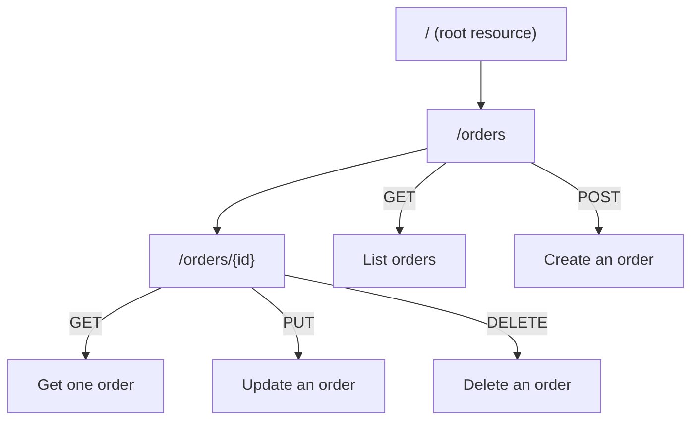

# 19 - REST API: Resources and Methods

> Goal: understand REST API's actual internal structure — **Resources** (URL paths) and **Methods** (HTTP verbs attached to them) — the building blocks everything else in a REST API is configured on top of.

---

## 1. The core idea

A REST API in API Gateway is organized as a **tree of Resources**, and each Resource can have one or more **Methods** attached — each Method is one specific HTTP verb (`GET`, `POST`, `PUT`, `DELETE`, etc.) configured independently, with its own integration, its own request/response settings, and its own authorization.

---

## 2. Architecture & workflow

---

## 3. The two concepts in detail

| Concept | What it is |
|---|---|
| **Resource** | A URL path segment — a static one like `/orders`, or a **path parameter** like `/orders/{id}` that captures a dynamic value straight from the URL |
| **Method** | An HTTP verb attached to a specific Resource — each combination (`GET /orders`, `POST /orders`, `GET /orders/{id}`...) is its **own independent configuration**, not a shared setting across the whole resource |

This is exactly the [CRUD](10-What-Is-CRUD.md) note's mapping made concrete inside API Gateway's own configuration model — each CRUD operation becomes one Method on one Resource.

> 🎯 **Exam tip**: because every Method is independently configured, it's entirely possible (and normal) for `GET /orders/{id}` to require authentication while `GET /orders` doesn't — a scenario testing "can different operations on the same resource have different security requirements" is testing exactly this independence.

---

## 4. Recap

- A REST API is a **tree of Resources**, each with independently configured **Methods** (HTTP verbs).
- Path parameters (`{id}`) let a single Resource capture dynamic URL segments.
- Every Method's integration, validation, and authorization settings are configured **per Method**, not shared across a Resource.
- Next: the [REST API Integration Types](20-REST-API-Integration-Types.md) note — how a Method actually reaches a backend.

### Sources
- [Set up API Gateway resources — AWS docs](https://docs.aws.amazon.com/apigateway/latest/developerguide/how-to-create-resource.html)
- [Set up API Gateway methods — AWS docs](https://docs.aws.amazon.com/apigateway/latest/developerguide/how-to-method-settings.html)
