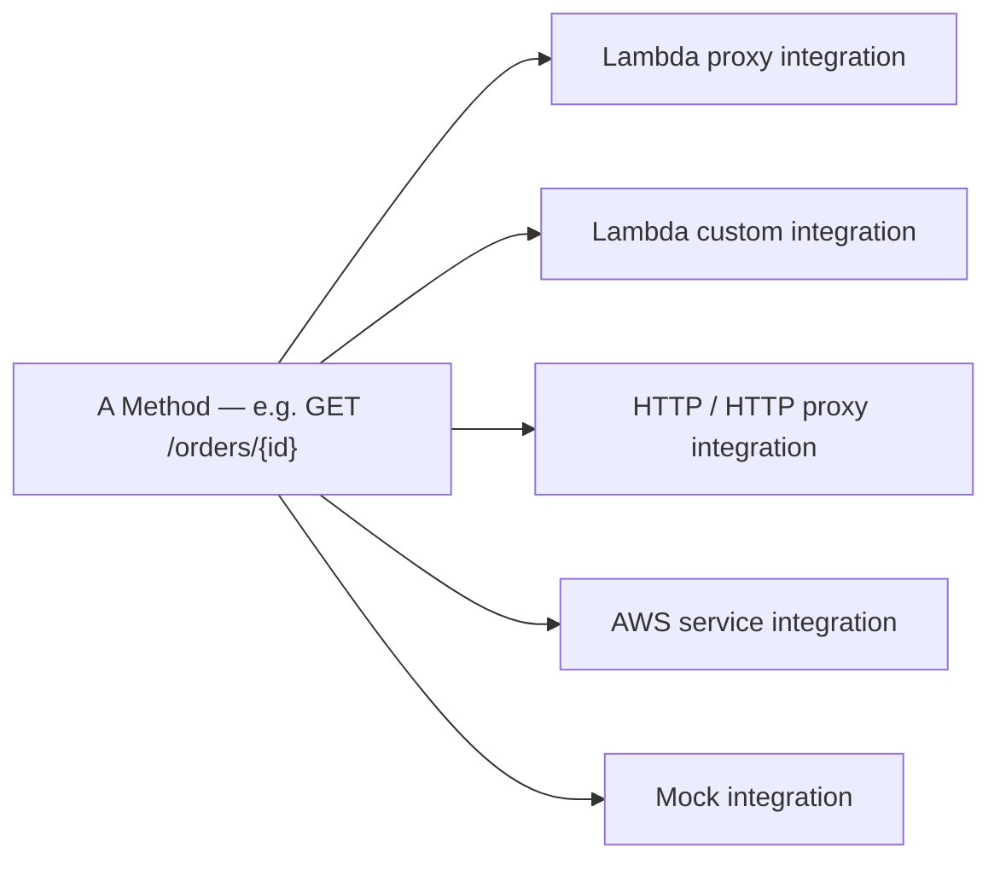

# 20 - REST API Integration Types

> Goal: survey the different ways a Method (from the [previous note](19-REST-API-Resources-and-Methods.md)) can actually be wired to a backend — genuinely different mechanisms, not just naming variations.

---

## 1. The five integration types

| Integration type | What happens |
|---|---|
| **Lambda proxy integration** | API Gateway passes the **entire raw request** to Lambda as one `event` object, and expects a specific response shape back — minimal transformation either direction, covered in depth in the [Proxy Integration](21-AWS-REST-API-Proxy-Integration.md) note |
| **Lambda custom (non-proxy) integration** | Uses **mapping templates** to reshape the request before Lambda sees it, and reshape Lambda's response before the client sees it — more control, more configuration |
| **HTTP / HTTP proxy integration** | Forwards the request to another HTTP endpoint — an existing backend service, with or without the same "pass everything through" behavior |
| **AWS service integration** | Calls another AWS service's API **directly** — e.g. writing straight to DynamoDB, without a Lambda function in between at all |
| **Mock integration** | Returns a response **without calling any backend** — useful for testing, or for CORS preflight `OPTIONS` responses that don't need real logic |

---

## 2. Why the choice matters

- **Proxy integrations** (Lambda proxy, HTTP proxy) are simpler to set up but push all request/response shaping logic into the backend code itself.
- **Non-proxy/custom integrations** let API Gateway itself reshape data via mapping templates — useful when the backend expects a very different shape than what the client sends, without modifying backend code.
- **AWS service integration** removes an entire layer (no Lambda needed) for straightforward "call this AWS API" cases — genuinely reduces both cost and moving parts for simple pass-through operations.

> 🎯 **Exam tip**: "trigger a Step Functions state machine or write directly to DynamoDB from an API call, without a Lambda function" is the clear signal for **AWS service integration** — a common exam pattern testing whether you know Lambda isn't actually required as a middle layer.

---

## 3. Recap

- Five integration types exist, each solving a different backend-wiring need: **Lambda proxy**, **Lambda custom**, **HTTP/HTTP proxy**, **AWS service**, and **Mock**.
- Proxy integrations push shaping logic into backend code; custom integrations let API Gateway do the reshaping via mapping templates.
- **AWS service integration** can skip Lambda entirely for direct AWS API calls.
- Next: the [AWS REST API Proxy Integration](21-AWS-REST-API-Proxy-Integration.md) note — a deeper look at the most commonly used type.

### Sources
- [Set up REST API methods in API Gateway — AWS docs](https://docs.aws.amazon.com/apigateway/latest/developerguide/how-to-method-settings.html)
- [Set up an API integration for a REST API — AWS docs](https://docs.aws.amazon.com/apigateway/latest/developerguide/how-to-integration-settings.html)
