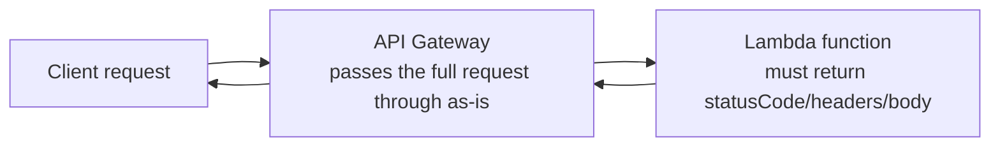

# 21 - AWS REST API Proxy Integration

> Goal: go deep on **Lambda proxy integration** specifically — the most commonly used [integration type](20-REST-API-Integration-Types.md) — including the exact request/response shape it requires, since a mismatch here is one of the most common real-world (and exam) API Gateway failures.

---

## 1. The core idea

With **Lambda proxy integration**, API Gateway does almost no transformation — it passes the client's **entire request** to Lambda as one `event` object, and expects Lambda's return value to be a **specific, exact shape** that it converts directly back into the HTTP response.

---

## 2. Architecture & workflow



---

## 3. What Lambda receives

The `event` object includes, among other fields:
- `httpMethod`, `path`, `resource`.
- `headers`, `queryStringParameters`, `pathParameters`.
- `body` — as a **raw string** (JSON needs explicit parsing inside the function, it isn't automatically parsed).

## 4. What Lambda must return

```json
{
  "statusCode": 200,
  "headers": { "Content-Type": "application/json" },
  "body": "{\"message\": \"a JSON string, not a raw object\"}"
}
```

Every field here is required for API Gateway to correctly build the HTTP response — `statusCode` becomes the HTTP status, `headers` become response headers, and `body` becomes the response body (as a string, even if it represents JSON).

> 🎯 **Exam tip**: "API Gateway returns a 502 Bad Gateway even though the Lambda function executed successfully in CloudWatch Logs" is a very common proxy-integration scenario — it almost always means the function's return value **doesn't match this exact shape** (e.g. returning a raw dictionary instead of one with `statusCode`/`body` keys), not an actual infrastructure problem.

---

## 5. Recap

- Proxy integration passes the entire request through with minimal transformation, in exchange for requiring Lambda to return an exact `statusCode`/`headers`/`body` shape.
- The request `body` always arrives as a raw string — parsing is the function's own responsibility.
- A `502` with a successfully-executing Lambda function is the classic symptom of a response-shape mismatch, not an infrastructure fault.
- Next: the [AWS REST API: Method Request Settings](22-AWS-REST-API-Method-Request-Settings.md) note — controlling what happens **before** the integration is even invoked.

### Sources
- [Set up Lambda proxy integrations in API Gateway — AWS docs](https://docs.aws.amazon.com/apigateway/latest/developerguide/set-up-lambda-proxy-integrations.html)
- [Working with AWS Lambda proxy integrations for REST APIs — AWS docs](https://docs.aws.amazon.com/apigateway/latest/developerguide/set-up-lambda-proxy-integrations.html)
