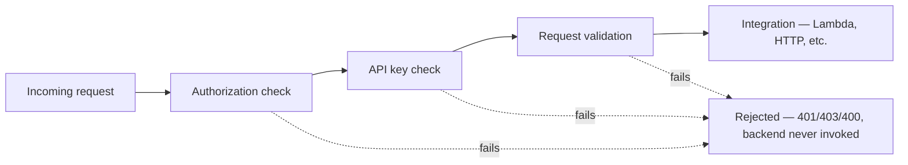

# 22 - AWS REST API: Method Request Settings

> Goal: understand what happens **before** a Method's integration is even invoked — authorization, API key requirements, and request validation — settings that live independently of whichever [integration type](20-REST-API-Integration-Types.md) is actually configured.

---

## 1. The problem: not every request should even reach the backend

Some checks genuinely don't need the backend involved at all — "is this request authenticated," "does it include a required field," "is an API key present." Handling these **at API Gateway itself**, before the integration runs, means malformed or unauthorized requests never cost a backend invocation.

---

## 2. Architecture & workflow

---

## 3. The Method Request settings

| Setting | What it does |
|---|---|
| **Authorization** | Attach an IAM policy check, a Lambda authorizer, or a Cognito user pool authorizer — enforced before the integration runs |
| **API Key Required** | Whether a valid API key must be present — ties directly into API Keys and Usage Plans |
| **Request Validator** | Validate the incoming body/parameters/headers against a defined **model schema**, rejecting malformed requests with a `400` before they reach the backend |
| **URL Query String Parameters / HTTP Request Headers** | Explicitly declare which query parameters/headers this Method expects — required for a *non-proxy* integration's mapping template to actually see those values |

---

## 4. Why Request Validator specifically matters

Without it, a Lambda function has to defensively check for missing/malformed fields on **every single invocation**, even ones that were never going to succeed. With a **Request Validator** and a defined model schema, API Gateway rejects genuinely bad input at the edge — the backend only ever sees requests that already passed basic shape validation.

> 🎯 **Exam tip**: "reduce unnecessary Lambda invocations caused by malformed client requests" is a strong signal for **Request Validator**, not a code change inside the Lambda function itself — the fix belongs at the API Gateway layer.

---

## 5. Recap

- Method Request settings run **before** the integration — authorization, API key checks, and request validation all happen here.
- **Request Validator** rejects malformed input at the edge, saving backend invocations for requests that could never have succeeded anyway.
- This closes out the REST API mechanics notes; next: the [REST API Lab - Part 1 Prerequisites](23-REST-API-Lab-Part-1-Prerequisites.md) — building a real REST API end to end.

### Sources
- [Set up request validation in API Gateway — AWS docs](https://docs.aws.amazon.com/apigateway/latest/developerguide/api-gateway-method-request-validation.html)
- [Control access to a REST API using Amazon API Gateway resource policies — AWS docs](https://docs.aws.amazon.com/apigateway/latest/developerguide/apigateway-resource-policies.html)
