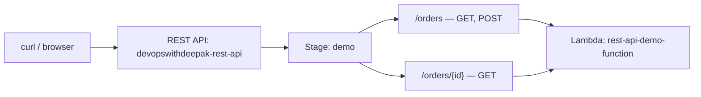

# 23 - REST API Lab - Part 1: Prerequisites

> Goal: preview and prepare for a second, deeper hands-on lab — this time building a real **REST API** (not HTTP API) with resources, path parameters, and an explicit deployment stage, exercising the mechanics covered across the last several notes.

---

## 1. What this lab builds, end to end

By the end of [Part 4](26-REST-API-Lab-Part-4-Testing-Lab-Functionality.md), this lab will have exercised **path parameters** ([Resources and Methods](19-REST-API-Resources-and-Methods.md)), **Lambda proxy integration** ([Proxy Integration](21-AWS-REST-API-Proxy-Integration.md)), and REST API's **explicit deploy-to-stage** requirement — genuinely different from the HTTP API lab's auto-deploy behavior in [Part 3 of the earlier lab](14-Part-3-Create-API-Gateway-HTTP-API.md).

---

## 2. Prerequisites

1. Confirm console access to **Lambda**, **API Gateway**, and **IAM** — same baseline access as the earlier HTTP API lab's [Part 1](12-Part-1-Lab-Prerequisites.md).
2. Pick one Region and use it consistently across all four parts of this lab.
3. This lab creates a **new** Lambda function (`rest-api-demo-function`) and a **new** REST API — it doesn't reuse anything from the earlier HTTP API lab, so both can exist side by side without conflicting.

---

## 3. Recap

- This lab specifically exercises REST-API-only mechanics: path parameters, proxy integration, and an explicit stage deployment.
- Same prerequisite bar as the earlier HTTP API lab — standard console access to Lambda, API Gateway, and IAM.
- Next: [Part 2 — Create REST API And Define Resources](24-REST-API-Lab-Part-2-Create-REST-API-And-Define-Resources.md).

### Sources
- [Create a REST API in Amazon API Gateway — AWS docs](https://docs.aws.amazon.com/apigateway/latest/developerguide/how-to-create-api.html)
