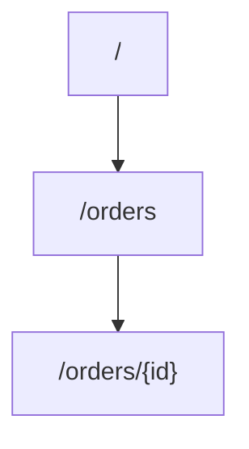

# 24 - REST API Lab - Part 2: Create REST API And Define Resources

> Goal: create the Lambda backend and the REST API's resource tree, continuing from [Part 1](23-REST-API-Lab-Part-1-Prerequisites.md).

---

## 1. Step 1 — Create the Lambda function

1. **Lambda console** → **Create function** → **Author from scratch** → **Function name**: `rest-api-demo-function` → **Runtime**: **Python 3.13** → **Create function**.
2. Replace the code with:
   ```python
   import json

   def lambda_handler(event, context):
       method = event.get("httpMethod")
       path_params = event.get("pathParameters") or {}

       if method == "GET" and "id" in path_params:
           body = {"order_id": path_params["id"], "status": "shipped"}
       elif method == "GET":
           body = {"orders": ["order-1", "order-2", "order-3"]}
       elif method == "POST":
           body = {"created": True, "received_body": event.get("body")}
       else:
           body = {"message": "unsupported method"}

       return {
           "statusCode": 200,
           "headers": {"Content-Type": "application/json"},
           "body": json.dumps(body)
       }
   ```
3. **Deploy**.

---

## 2. Step 2 — Create the REST API

1. **API Gateway console** → **Create API** → **REST API** → **Build**.
2. **API name**: `devopswithdeepak-rest-api` → **Endpoint Type**: **Regional** → **Create API**.

---

## 3. Step 3 — Define the resource tree



1. **Resources** → **Create Resource** → **Resource name**: `orders` → **Create Resource**.
2. With `/orders` selected → **Create Resource** → **Resource name**: `{id}` (the curly braces are literal, marking it as a path parameter) → **Create Resource**, producing `/orders/{id}`.

---

## 4. Recap

- The Lambda function already returns the exact `statusCode`/`headers`/`body` shape a proxy integration expects, matching [Part 2 of the earlier lab](13-Part-2-API-Using-Lambda.md)'s pattern.
- The resource tree now has both a static path (`/orders`) and a dynamic path parameter (`/orders/{id}`) — no methods attached yet.
- Next: [Part 3 — Add Method Resources and Deploy API To a Stage](25-REST-API-Lab-Part-3-Add-Method-Resources-and-Deploy.md).

### Sources
- [Create a REST API in Amazon API Gateway — AWS docs](https://docs.aws.amazon.com/apigateway/latest/developerguide/how-to-create-api.html)
- [Set up API Gateway resources — AWS docs](https://docs.aws.amazon.com/apigateway/latest/developerguide/how-to-create-resource.html)
