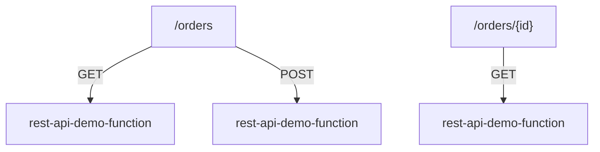

# 25 - REST API Lab - Part 3: Add Method Resources and Deploy API To a Stage

> Goal: attach methods to the resource tree built in [Part 2](24-REST-API-Lab-Part-2-Create-REST-API-And-Define-Resources.md), then deploy the API — REST API's explicit deployment step, genuinely different from HTTP API's auto-deploy default.

---

## 1. Step 1 — Add the methods

1. Select `/orders` → **Create Method** → **GET** → **Integration type**: **Lambda Function** → check **Lambda proxy integration** → select `rest-api-demo-function` → **Create Method**.
2. Repeat on `/orders`: **Create Method** → **POST** → same Lambda proxy setup.
3. Select `/orders/{id}` → **Create Method** → **GET** → same Lambda proxy setup.

---

## 2. Step 2 — Deploy to a stage

1. **Deploy API** → **Deployment stage**: **[New Stage]** → **Stage name**: `demo` → **Deploy**.
2. Note the **Invoke URL** shown on the stage's page, of the form `https://<api-id>.execute-api.<region>.amazonaws.com/demo`.

> 🧠 This explicit deploy step is genuinely required for **every** future change too — adding, removing, or modifying a method won't take effect on the live URL until you deploy again. This is the single biggest practical difference from the HTTP API lab's `$default` auto-deploy stage used earlier in this folder.

---

## 3. Recap

- All three method/resource combinations (`GET /orders`, `POST /orders`, `GET /orders/{id}`) now route to the same Lambda function via proxy integration.
- REST API requires an **explicit deploy to a stage** — nothing is live on the invoke URL until this step runs, and it must be repeated after every future change.
- Next: [Part 4 — Testing Lab Functionality](26-REST-API-Lab-Part-4-Testing-Lab-Functionality.md).

### Sources
- [Deploy a REST API in Amazon API Gateway — AWS docs](https://docs.aws.amazon.com/apigateway/latest/developerguide/how-to-deploy-api.html)
