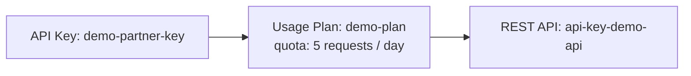

# 28 - LAB - API Keys And Usage Plans

> Goal: build a real API Key and Usage Plan, require the key on a real Method, and prove both the "missing key is rejected" and "quota limit actually triggers" behaviors — not just describe them. Entirely via the **AWS Console**.

---

## 1. What you're building



---

## 2. Step 1 — Create a minimal REST API requiring an API key

1. **Lambda console** → **Create function** → **Author from scratch** → **Function name**: `api-key-demo-function` → **Runtime**: **Python 3.13** → **Create function**.
2. Code:
   ```python
   import json
   def lambda_handler(event, context):
       return {"statusCode": 200, "body": json.dumps({"message": "authorized call succeeded"})}
   ```
   **Deploy**.
3. **API Gateway console** → **Create API** → **REST API** → **Build** → **API name**: `api-key-demo-api` → **Create API**.
4. **Resources** → **Create Resource** → `data` → **Create Method** → **GET** → **Lambda Function**, proxy integration → `api-key-demo-function`.
5. On the **GET** method → **Method Request** → **API Key Required**: **true**.
6. **Deploy API** → new stage `demo`.

---

## 3. Step 2 — Prove a missing key is rejected

```bash
curl https://<api-id>.execute-api.<region>.amazonaws.com/demo/data
```
Confirm a `403 Forbidden` with a message like `"Forbidden"` — the request never reached Lambda at all, exactly matching [API Keys and Usage Plans](27-API-Keys-And-Usage-Plans.md) Section 3's Method Request enforcement point.

---

## 4. Step 3 — Create the API Key and Usage Plan

1. **API Gateway console** → **API Keys** → **Create API key** → **Name**: `demo-partner-key` → **Auto Generate** → **Save**.
2. Note/copy the generated key value.
3. **Usage Plans** → **Create** → **Name**: `demo-plan` → **Throttling**: rate 10, burst 5 → **Quota**: **5 requests per Day** (deliberately tiny for this demo) → **Next**.
4. **Associated API Stages** → add `api-key-demo-api` / `demo` → **Next**.
5. **Associated API Keys** → add `demo-partner-key` → **Done**.

---

## 5. Step 4 — Call it with the key and watch the quota trip

```bash
curl -H "x-api-key: <your-key-value>" https://<api-id>.execute-api.<region>.amazonaws.com/demo/data
```
Run this **six times in a row**. Confirm the first five succeed with `"authorized call succeeded"`, and the sixth returns a `429 Too Many Requests` — direct, concrete proof the Usage Plan's daily quota is a real enforced limit, not just a dashboard number.

---

## 6. Troubleshooting

| Symptom | Likely cause |
|---|---|
| Request with the key still returns `403` | The Usage Plan wasn't associated with **both** the API stage **and** the key (Section 4, Steps 4-5) — both associations are required |
| Quota never trips even after 6+ calls | Confirm the quota was actually set to 5/day, not left at a default/unlimited value |
| `429` appears immediately on the first call | The throttle **rate/burst** values (not the quota) may be too low — recheck Section 4, Step 3 |

---

## 7. Cleanup

1. **API Gateway console** → **Usage Plans** → delete `demo-plan`.
2. **API Keys** → delete `demo-partner-key`.
3. Delete `api-key-demo-api`.
4. **Lambda console** → delete `api-key-demo-function`.

---

## 8. Recap

- A Method with **API Key Required** genuinely rejects unkeyed requests with a `403`, before the backend is ever invoked.
- A Usage Plan's **quota** is a real, enforced limit — this demo proved it by tripping a deliberately tiny 5-requests-per-day quota live.
- Both the API stage **and** the API key must be explicitly associated with a Usage Plan — missing either one leaves the key non-functional.
- Next: the [API Keys Resources Policy](29-API-Keys-Resources-Policy.md) note — a related but distinct REST API access-control mechanism.

### Sources
- [Setting up API keys using the API Gateway console — AWS docs](https://docs.aws.amazon.com/apigateway/latest/developerguide/api-gateway-setup-api-key-with-console.html)
- [Creating and using usage plans with API keys — AWS docs](https://docs.aws.amazon.com/apigateway/latest/developerguide/api-gateway-api-usage-plans.html)
