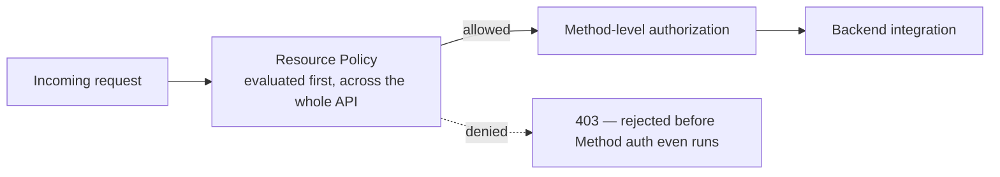

# 29 - API Keys Resources Policy

> Goal: understand API Gateway's **resource policy** — a genuinely different access-control layer from both [Method-level authorization](22-AWS-REST-API-Method-Request-Settings.md) and [API Keys/Usage Plans](27-API-Keys-And-Usage-Plans.md) — controlling access based on **who's calling from where**, at the level of the whole API.

---

## 1. The problem: some access rules apply to the whole API, not one Method

Method Request authorization and API Keys both operate **per Method**. Sometimes the actual requirement is broader: "only allow calls from this specific VPC," "block this specific IP range entirely," "only allow this specific AWS account to invoke the API at all" — rules that should apply **uniformly across the whole API**, not configured one Method at a time.

---

## 2. Architecture & workflow

---

## 3. What a resource policy is

A **resource policy** is an IAM policy document, attached to the API itself (not to a caller's identity), that controls **who can invoke this API at all** — evaluated as a JSON policy, just like an S3 bucket policy or a KMS key policy covered elsewhere in this project. It can restrict by:

- **Source IP address / CIDR range** — allow or deny specific network ranges.
- **VPC or VPC endpoint** — restrict a **Private** API (see [REST API Endpoint Type](16-REST-API-Endpoint-Type.md)) to only be callable from a specific VPC endpoint.
- **AWS account or IAM principal** — restrict which accounts/roles are allowed to call the API, useful for APIs shared across accounts.

---

## 4. Why this matters as a distinct control

Resource policies are evaluated **independently** of Method-level authorization and API Keys — a request can be perfectly authenticated and hold a valid API key, and **still get rejected** if the resource policy's IP/VPC/account conditions aren't met. This is the same "two-layer permission model" idea covered in this project's [KMS note](../Security-Services/02-AWS-Key-Management-Service-KMS.md), applied here to API Gateway instead of S3/KMS.

> 🎯 **Exam tip**: "restrict an API so it can only be called from a specific corporate IP range or VPC, regardless of what credentials the caller has" is the clearest resource-policy signal — Method-level authorization alone can't express a network-location restriction like this.

---

## 5. Recap

- A **resource policy** is an IAM policy attached to the whole API, controlling access by source IP, VPC, or AWS account/principal — evaluated independently of Method-level auth or API keys.
- It's the mechanism that makes a **Private** endpoint type actually restrictable to a specific VPC endpoint.
- Next: the [API Gateway Security Edge Protection | Authentication & Authorization](30-API-Gateway-Security-Edge-Protection.md) note — pulling every access-control layer covered so far into one coherent picture.

### Sources
- [Control access to a REST API using Amazon API Gateway resource policies — AWS docs](https://docs.aws.amazon.com/apigateway/latest/developerguide/apigateway-resource-policies.html)
