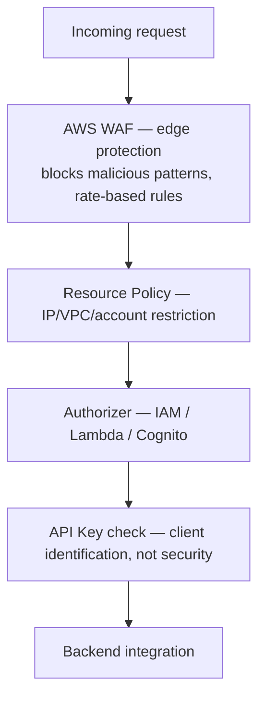

# 30 - API Gateway Security Edge Protection | Authentication & Authorization

> Goal: pull every access-control mechanism covered so far into one coherent picture — since the exam frequently tests picking the *right* one for a specific scenario, not just recognizing that "some security exists."

---

## 1. The full stack of API Gateway access controls

---

## 2. Each layer's actual job

| Layer | Question it answers |
|---|---|
| **AWS WAF** | "Does this request look like a known attack pattern (SQL injection, excessive rate, bad IP reputation)?" — genuine **edge protection**, evaluated before the request even reaches API Gateway's own logic |
| **[Resource Policy](29-API-Keys-Resources-Policy.md)** | "Is this request coming from an allowed network location or AWS account?" |
| **Authorizer** | "Is this specific caller identity allowed to call this API at all?" |
| **[API Key](27-API-Keys-And-Usage-Plans.md)** | "Which specific client is this, for metering purposes?" — **not** a security control on its own |

---

## 3. The three authorizer types

| Authorizer | How it verifies identity |
|---|---|
| **IAM authorization** | Caller signs the request with **AWS SigV4** credentials — API Gateway checks the resulting IAM permissions, the same mechanism used for calling any AWS API directly |
| **Lambda authorizer** | A Lambda function you write receives the incoming request (or a bearer token) and returns an IAM policy document deciding allow/deny — full custom logic, e.g. validating a third-party JWT |
| **Cognito authorizer** | Validates a **Cognito User Pool** token directly — the standard choice when end users authenticate through Cognito |

> 🎯 **Exam tip**: "internal service-to-service calls within AWS, already using IAM roles" → **IAM authorization**. "Custom/third-party token format, or business logic beyond simple token validation" → **Lambda authorizer**. "End users signing in through a Cognito-backed app" → **Cognito authorizer**. Getting this three-way distinction right is one of the most frequently tested specific points in the whole API Gateway topic.

---

## 4. Recap

- Real API Gateway security is **layered** — WAF (edge), resource policy (network/account), authorizer (identity), API key (metering, not security) each solve a different piece.
- The three authorizer types map cleanly to three different identity sources: **IAM** (AWS-internal), **Lambda** (custom/third-party), **Cognito** (end-user sign-in).
- Next: the [API Gateway Canary Deployment](31-API-Gateway-Canary-Deployment.md) note — a different concern entirely, safely rolling out API changes rather than controlling who can call the API.

### Sources
- [Control access to a REST API — AWS docs](https://docs.aws.amazon.com/apigateway/latest/developerguide/apigateway-control-access-to-api.html)
- [Use API Gateway Lambda authorizers — AWS docs](https://docs.aws.amazon.com/apigateway/latest/developerguide/apigateway-use-lambda-authorizer.html)
- [Control access to a REST API using Amazon Cognito user pools — AWS docs](https://docs.aws.amazon.com/apigateway/latest/developerguide/apigateway-integrate-with-cognito.html)
