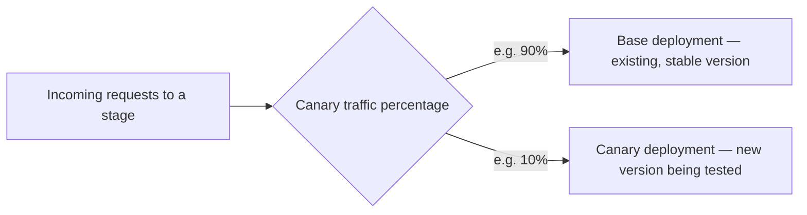

# 31 - API Gateway Canary Deployment

> Goal: understand how a REST API stage can safely test a new deployment against a **small slice of real traffic** before committing everyone to it — the same underlying idea as this project's [Lambda alias weighted-routing note](../Lambda/17-Lambda-Aliases.md), applied here at the API Gateway stage level.

---

## 1. The problem: deploying straight to 100% of traffic is risky

Once a REST API is deployed to a stage, every request to that stage's invoke URL gets the new version immediately — if something's subtly broken, **all** callers feel it at once, with no gradual rollout and no easy comparison against the previous, known-good behavior.

---

## 2. Architecture & workflow

---

## 3. How it actually works

1. Enable **Canary** on an existing stage, and set a **traffic percentage** (e.g. 10%) that should be routed to the canary.
2. Deploy the new API version specifically **to the canary**, not the base.
3. That percentage of real requests now hits the new version, while the rest continue on the stable base — both are the **same stage**, same invoke URL, split internally.
4. Monitor the canary's own separate CloudWatch metrics/logs to compare behavior against the base before deciding.
5. **Promote** the canary (making it the new base for 100% of traffic) once confident, or **delete** the canary to roll back entirely with zero impact on the stable base.

---

## 4. Why this matters

> 🎯 **Exam tip**: "test a new API Gateway deployment against a small percentage of production traffic before a full rollout" is the clearest Canary Deployment signal — and it's a genuinely **REST API stage feature**, distinct from any Lambda-level versioning/aliasing that might also be happening behind that stage.

---

## 5. Recap

- Canary deployment splits a **single stage's** traffic between a stable base and a new canary version, by a configurable percentage.
- The canary can be monitored independently and then either **promoted** (becomes the new base) or **deleted** (instant rollback, zero base impact).
- This is the same underlying gradual-rollout idea as Lambda's weighted alias routing, applied at the API Gateway stage layer instead.
- Next: the [Custom Domain API Gateway (Part 1)](32-Custom-Domain-API-Gateway-Part-1.md) note — a different kind of stage-level configuration.

### Sources
- [Deploying a REST API canary release — AWS docs](https://docs.aws.amazon.com/apigateway/latest/developerguide/canary-release.html)
