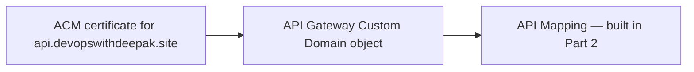

# 32 - Custom Domain API Gateway (Part 1): Certificate and Custom Domain Object

> Goal: understand why an API's raw `execute-api` URL isn't something you'd hand to real users or partners, and build the first half of a real custom domain setup — the ACM certificate and the Custom Domain object itself — using this project's real domain, `devopswithdeepak.site` (already used for the [ACM](../Security-Services/01.01-ACM-Certificate-Demo.md) and [WAF](../Security-Services/04.01-WAF-Protection-Demo.md) hands-on demos).

---

## 1. The problem: `xyz123.execute-api.region.amazonaws.com` is not a URL you'd publish

A working API needs a **memorable, branded URL** — `api.devopswithdeepak.site`, not an auto-generated, Region-and-account-specific string. A **custom domain name** in API Gateway is what makes that possible, backed by a real TLS certificate for that domain.

---

## 2. Architecture & workflow

---

## 3. Step 1 — Request the certificate

1. **ACM console** (in the **same Region** as your REST API, since this will be a **Regional** custom domain — recall this differs from CloudFront, which specifically requires `us-east-1`) → **Request a certificate** → **Request a public certificate**.
2. **Fully qualified domain name**: `api.devopswithdeepak.site`.
3. **Validation method**: **DNS validation**.
4. **Request** → **Create records in Route 53** (since this project's hosted zone for `devopswithdeepak.site` already exists from the ACM note) → wait for status **Issued**.

---

## 4. Step 2 — Create the Custom Domain object in API Gateway

1. **API Gateway console** → **Custom domain names** → **Create**.
2. **Domain name**: `api.devopswithdeepak.site`.
3. **Endpoint configuration**: **Regional**.
4. **ACM certificate**: select the certificate issued in Section 3.
5. **Minimum TLS version**: **TLS 1.2** — the same security policy setting from [REST API TLS & Endpoint Security Policies](17-REST-API-TLS-Endpoint-Security-Policies.md).
6. **Create domain name**.
7. Note the **API Gateway domain name** value shown (a long CloudFront-or-Regional-style target) — this is what DNS needs to point to, built in Part 2.

---

## 5. Recap

- A **Regional** custom domain's certificate must be requested in the **same Region** as the API — unlike CloudFront-backed (edge-optimized) domains, which specifically require `us-east-1`.
- The Custom Domain object itself is just the certificate + TLS policy binding — it doesn't route to any specific API yet, that's what an **API Mapping** does next.
- Next: [Custom Domain API Gateway (Part 2)](33-Custom-Domain-API-Gateway-Part-2.md) — mapping this domain to a real API and testing it live.

### Sources
- [Custom domain name for public REST APIs in API Gateway — AWS docs](https://docs.aws.amazon.com/apigateway/latest/developerguide/how-to-custom-domains.html)
