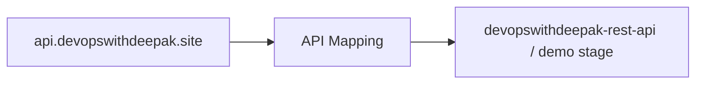

# 33 - Custom Domain API Gateway (Part 2): API Mapping and DNS

> Goal: finish the custom domain setup started in [Part 1](32-Custom-Domain-API-Gateway-Part-1.md) — mapping `api.devopswithdeepak.site` to a real API, pointing DNS at it, and testing the finished, branded URL live.

---

## 1. Step 1 — Create the API Mapping

1. **API Gateway console** → **Custom domain names** → `api.devopswithdeepak.site` → **API mappings** → **Configure API mappings** → **Add new mapping**.
2. **API**: select any REST or HTTP API from this folder's earlier labs (e.g. `devopswithdeepak-rest-api`).
3. **Stage**: `demo`.
4. **Path**: leave blank (maps the domain's root directly to this stage) → **Save**.



---

## 2. Step 2 — Point DNS at the custom domain

1. **Route 53 console** → the hosted zone for `devopswithdeepak.site` → **Create record**.
2. **Record name**: `api`.
3. **Record type**: **A** → **Alias**: **Yes** → **Route traffic to**: **Alias to API Gateway API** → select the Region and the `api.devopswithdeepak.site` custom domain from Part 1.
4. **Create records**.

---

## 3. Step 3 — Test the finished, branded URL

1. Wait a few minutes for DNS propagation.
2. Test:
   ```bash
   curl https://api.devopswithdeepak.site/orders
   ```
3. Confirm this returns the **same response** as calling the raw `execute-api` invoke URL directly — same API, same Lambda backend, now reachable through a real, memorable, correctly-certificated domain.

---

## 4. Troubleshooting

| Symptom | Likely cause |
|---|---|
| SSL/certificate error in the browser | The certificate in [Part 1](32-Custom-Domain-API-Gateway-Part-1.md) wasn't fully **Issued** before creating the custom domain object, or was requested in the wrong Region for a Regional endpoint |
| `curl` returns `Could not resolve host` | DNS record not yet propagated, or the alias target doesn't match the custom domain exactly — recheck Section 2 |
| Domain resolves but returns `Not Found` | The API Mapping's **Path** and **Stage** don't match the route you're testing — recheck Section 1 |

---

## 5. Cleanup

1. **Route 53 console** → delete the `api` A record.
2. **API Gateway console** → delete the `api.devopswithdeepak.site` custom domain and its mapping.
3. **ACM console** → delete the `api.devopswithdeepak.site` certificate, if not reused elsewhere.

---

## 6. Recap

- An **API Mapping** is the piece that actually connects a Custom Domain object to a specific API and stage — the domain alone (from Part 1) doesn't route anywhere without it.
- Route 53's **Alias to API Gateway API** record type is the standard way to point a domain at a custom domain name, mirroring the same alias-record pattern used for CloudFront in this project's ACM demo.
- Next: the [AWS API Gateway - Exam Cheat Sheet](34-AWS-API-Gateway-Exam-Cheat-Sheet.md) note — a compact recap of everything covered across this folder's API Gateway section.

### Sources
- [Custom domain name for public REST APIs in API Gateway — AWS docs](https://docs.aws.amazon.com/apigateway/latest/developerguide/how-to-custom-domains.html)
- [Routing traffic to an API Gateway API by using your domain name — AWS docs](https://docs.aws.amazon.com/Route53/latest/DeveloperGuide/routing-to-api-gateway.html)
