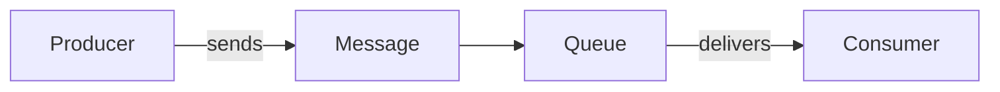

# 36 - Core Components SQS

> Goal: name and understand the actual pieces SQS is built from — Queue, Message, Producer, Consumer — the vocabulary every later SQS note in this folder assumes.

---

## 1. The four core components

| Component | What it is |
|---|---|
| **Queue** | The named container messages sit in — this is the actual AWS resource you create |
| **Message** | A single unit of data, up to **256 KB** by default (extendable via the **SQS Extended Client Library**, which stores the payload in S3 and passes a reference through the queue) |
| **Producer** | Whatever sends messages onto the queue — an application, a Lambda function, another AWS service |
| **Consumer** | Whatever reads and processes messages off the queue |

---

## 2. A message's basic attributes

- **Message ID** — a unique identifier assigned by SQS when the message is sent.
- **Body** — the actual payload/content.
- **Message attributes** — optional structured metadata (key-value pairs) separate from the body, useful for filtering/routing without parsing the body itself.
- **Receipt handle** — issued each time a message is **received** (not sent) — required to delete the message afterward, covered in the [SQS Pull-Based Mechanism](37-SQS-Pull-Based-Mechanism.md) note.

---

## 3. Recap

- **Queue**, **Message**, **Producer**, and **Consumer** are the four foundational SQS building blocks.
- Messages carry a **body** plus optional **attributes**, and receiving one (not sending it) issues a **receipt handle**.
- Next: the [SQS Pull-Based Mechanism](37-SQS-Pull-Based-Mechanism.md) note — how a Consumer actually gets messages out of a queue.

### Sources
- [Amazon SQS message structure — AWS docs](https://docs.aws.amazon.com/AWSSimpleQueueService/latest/SQSDeveloperGuide/sqs-message-metadata.html)
