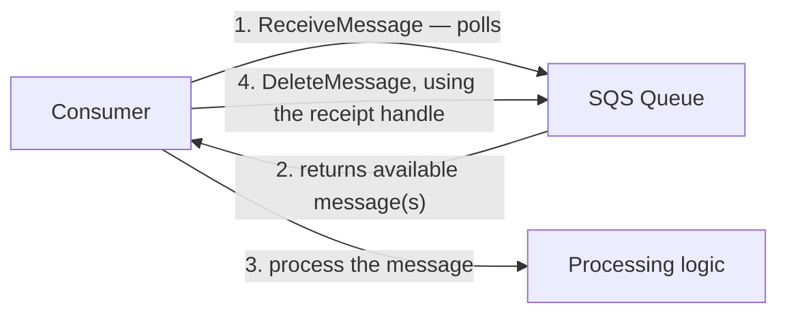

# 37 - SQS Pull-Based Mechanism

> Goal: understand why SQS is a **pull** system — consumers actively ask for messages, rather than SQS pushing messages to them — and what that implies about polling behavior.

---

## 1. The core idea: pull, not push

Unlike SNS (covered later in this folder), which **pushes** messages to subscribers, SQS is fundamentally a **pull-based** system: a consumer must actively call `ReceiveMessage` to get anything off the queue. SQS never initiates contact with a consumer on its own.

---

## 2. Architecture & workflow

---

## 3. Short polling vs. long polling

| | Short polling | Long polling |
|---|---|---|
| **Behavior** | Returns **immediately**, even if no messages are available | **Waits** up to a configured duration (max 20 seconds) for a message to arrive before returning empty |
| **Cost implication** | More frequent, often-empty API calls | Fewer, more efficient API calls |
| **Default** | (Historically the default) | **Recommended**, and covered in depth in the [SQS Configuration Option Part 3](41-SQS-Configuration-Option-Part-3-Receive-Message-Wait-Time.md) note |

---

## 4. The four-step consumer lifecycle

1. **Receive** — the consumer calls `ReceiveMessage`, polling the queue.
2. **Process** — the consumer does whatever work the message requires.
3. **Delete** — the consumer calls `DeleteMessage`, using the **receipt handle** issued at receive time — this is the step that actually removes the message from the queue.
4. If the consumer **never deletes** the message (crash, bug, timeout), the message becomes visible again for another consumer to pick up — the exact mechanism the [Visibility Timeout](40-SQS-Configuration-Part-2-Visibility-Timeout.md) note covers next.

> 🎯 **Exam tip**: "why didn't my consumer receive a message the instant it was sent" is often just this pull model working as designed — SQS doesn't push, so there's always some polling interval involved, unless a mechanism like SQS-to-Lambda event source mapping (which itself polls on your behalf) is in use.

---

## 5. Recap

- SQS is **pull-based** — consumers must actively poll via `ReceiveMessage`; SQS never pushes.
- **Long polling** (waiting up to 20 seconds) is more efficient than short polling (returning immediately, often empty).
- A message isn't actually removed until the consumer explicitly calls `DeleteMessage` with its receipt handle — an undeleted message reappears for reprocessing.
- Next: the [Types Of SQS Queues](38-Types-Of-SQS-Queues.md) note — Standard vs. FIFO, the foundational queue-type decision.

### Sources
- [Amazon SQS short and long polling — AWS docs](https://docs.aws.amazon.com/AWSSimpleQueueService/latest/SQSDeveloperGuide/sqs-short-and-long-polling.html)
