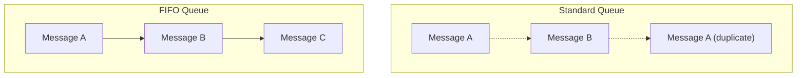

# 38 - Types Of SQS Queues

> Goal: understand the foundational SQS decision — **Standard** vs. **FIFO** — before the later, deeper FIFO-specific notes (deduplication, throughput limits) build on top of it.

---

## 1. The two queue types

| | Standard Queue | FIFO Queue |
|---|---|---|
| **Ordering** | **Best-effort** — messages may arrive out of order | **Strict, guaranteed** first-in-first-out order |
| **Delivery guarantee** | **At-least-once** — a message might be delivered **more than once** | **Exactly-once processing** — no duplicates, within the deduplication window |
| **Throughput** | Nearly unlimited | Limited (up to 3,000 messages/second with batching, or 300/second without — covered in the [FIFO Throughput Limit](49-FIFO-Throughput-Limit.md) note) |
| **Naming requirement** | Any name | Queue name **must** end in `.fifo` |
| **Typical use case** | High-throughput workloads where strict order/no-duplicates isn't essential | Order-sensitive workloads — financial transactions, sequential command processing |

---

## 2. Why Standard queues can deliver duplicates or out-of-order messages

Standard queues are built for **massive scale and availability** — that design trades away strict ordering and exactly-once delivery, since guaranteeing both across a highly distributed, nearly-unlimited-throughput system is fundamentally harder and slower. This isn't a bug — it's an explicit, documented design trade-off, and **consumers of a Standard queue should be built to be idempotent** (safely handle processing the same message twice) as standard practice.

> 🎯 **Exam tip**: "processing order matters, and duplicate processing would cause real problems (e.g. double-charging a customer)" → **FIFO queue**. "Extremely high throughput, order doesn't matter, occasional duplicates are tolerable" → **Standard queue**. This is one of the most reliably tested distinctions in the whole SQS topic.

---

## 3. Recap

- **Standard** queues: best-effort ordering, at-least-once delivery, nearly unlimited throughput.
- **FIFO** queues: strict ordering, exactly-once processing, limited throughput, `.fifo`-suffixed names required.
- Consumers of a Standard queue should always be written to be idempotent, since duplicate delivery is an expected, designed-for behavior.
- Next: the [SQS Configuration Option Part 1](39-SQS-Configuration-Option-Part-1.md) note — the settings available on a queue regardless of type.

### Sources
- [Amazon SQS queue types — AWS docs](https://docs.aws.amazon.com/AWSSimpleQueueService/latest/SQSDeveloperGuide/sqs-queue-types.html)
