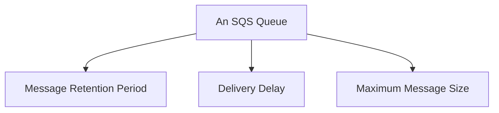

# 39 - SQS Configuration Option (Part 1)

> Goal: cover the general per-queue settings available on any SQS queue — message retention, delivery delay, and message size — before Part 2 and Part 3 go deep on the two settings that get their own dedicated notes: Visibility Timeout and Receive Message Wait Time.

---

## 1. The settings covered here

| Setting | What it controls | Range |
|---|---|---|
| **Message Retention Period** | How long an unconsumed message stays in the queue before SQS **automatically deletes it** | 1 minute to **14 days** (default: 4 days) |
| **Delivery Delay** | Delays a message's initial visibility to consumers after it's sent — useful for a brief "grace period" before processing starts | 0 to 15 minutes |
| **Maximum Message Size** | The largest a single message body can be | Up to **256 KB** (larger payloads need the **SQS Extended Client Library**, storing the actual payload in S3) |

---

## 2. Why Message Retention Period matters in practice

If a consumer is down for an extended period (a bug, a bad deployment, an outage), messages don't wait forever — after the retention period expires, they're **gone**, with no way to recover them. This is a real, concrete reason to pair a queue with a **Dead-Letter Queue** (covered later in this folder) and to actively monitor queue depth, rather than assuming messages will simply wait indefinitely.

> 🎯 **Exam tip**: "messages are disappearing from a queue and we don't know why, and the consumer has been down for over a week" — check the **Message Retention Period** first; a queue with the 4-day default would have already silently discarded anything older than that.

---

## 3. Recap

- **Message Retention Period** (up to 14 days) determines how long a message survives if never consumed — after that, it's gone permanently.
- **Delivery Delay** postpones a message's initial visibility; **Maximum Message Size** caps a single message at 256 KB by default.
- Next: the [SQS Configuration Part 2: Visibility Timeout](40-SQS-Configuration-Part-2-Visibility-Timeout.md) note — the setting that governs what happens *while* a message is being processed.

### Sources
- [Amazon SQS queue and message identifiers — AWS docs](https://docs.aws.amazon.com/AWSSimpleQueueService/latest/SQSDeveloperGuide/sqs-queue-message-identifiers.html)
- [Configuring Amazon SQS queue parameters — AWS docs](https://docs.aws.amazon.com/AWSSimpleQueueService/latest/SQSDeveloperGuide/sqs-configure-queue-parameters.html)
