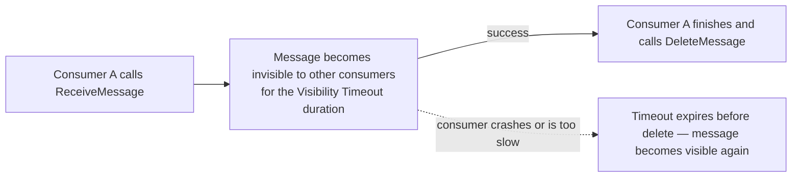

# 40 - SQS Configuration (Part 2): Visibility Timeout

> Goal: understand **Visibility Timeout** — the mechanism that prevents two consumers from processing the same message simultaneously, and the single most commonly misconfigured SQS setting.

---

## 1. The problem: a message being processed shouldn't be handed to a second consumer

When a consumer calls `ReceiveMessage`, SQS doesn't delete the message immediately — it just **hides it** from other consumers temporarily, trusting that the receiving consumer will either finish processing and delete it, or fail and let it reappear. Without this, two different consumers could both receive and process the **same** message at the same time.

---

## 2. Architecture & workflow

---

## 3. The setting itself

| | Detail |
|---|---|
| **Range** | 0 seconds to **12 hours** |
| **Default** | 30 seconds |
| **What happens if it's too short** | The consumer is still processing when the timeout expires — the message becomes visible again, and a **second** consumer may pick it up, causing duplicate processing |
| **What happens if it's too long** | If a consumer crashes without deleting the message, it stays invisible (effectively "stuck," unprocessed) for the entire timeout duration before anyone else can retry it |

---

## 4. Changing it dynamically: `ChangeMessageVisibility`

A consumer that knows it needs more time (a long-running job) can call `ChangeMessageVisibility` to **extend** the timeout for a specific message it's currently holding, rather than being stuck with whatever the queue's default was at receive time.

> 🎯 **Exam tip**: "a message is being processed twice" is the classic **Visibility Timeout set too short relative to actual processing time** scenario — the fix is increasing the timeout (or having the consumer call `ChangeMessageVisibility`), not touching Message Retention Period or any other setting.

---

## 5. Recap

- Visibility Timeout hides a received message from other consumers for a configurable duration (default 30s, max 12 hours) — it does **not** delete the message.
- Too short → duplicate processing risk; too long → slow recovery from a crashed consumer.
- `ChangeMessageVisibility` lets a consumer extend its own processing window dynamically.
- Next: the [SQS Configuration Option Part 3: Receive message wait time](41-SQS-Configuration-Option-Part-3-Receive-Message-Wait-Time.md) note — the polling-side counterpart to this receiving-side setting.

### Sources
- [Amazon SQS visibility timeout — AWS docs](https://docs.aws.amazon.com/AWSSimpleQueueService/latest/SQSDeveloperGuide/sqs-visibility-timeout.html)
