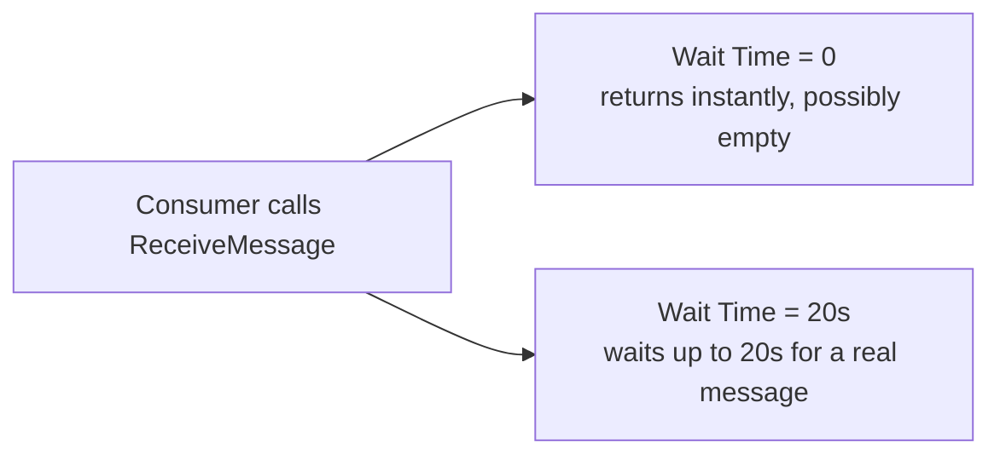

# 41 - SQS Configuration Option (Part 3): Receive Message Wait Time

> Goal: understand **Receive Message Wait Time** as the actual configuration knob behind the short-polling-vs-long-polling distinction introduced in the [SQS Pull-Based Mechanism](37-SQS-Pull-Based-Mechanism.md) note.

---

## 1. The setting

**Receive Message Wait Time** controls how long a `ReceiveMessage` call **waits** for a message to become available before returning an empty response:

| Value | Behavior |
|---|---|
| **0 seconds** (default) | **Short polling** — returns immediately, even if the queue is empty at that instant |
| **1 to 20 seconds** | **Long polling** — waits up to that duration for a message to arrive before giving up and returning empty |

---

## 2. Architecture & workflow

---

## 3. Why long polling is genuinely recommended

- **Fewer empty responses** — with short polling on a low-traffic queue, most `ReceiveMessage` calls return nothing, wasting API calls (and their associated cost) for no result.
- **Lower cost** — fewer total API calls needed to reliably catch new messages as they arrive.
- **Lower latency variance** for the consumer, since it doesn't need to immediately re-poll after every empty response — it's already waiting.

This can be set as the queue's **default wait time**, or overridden per individual `ReceiveMessage` call.

> 🎯 **Exam tip**: "reduce the number of empty responses and the cost of polling an SQS queue" → set **Receive Message Wait Time** to a non-zero value (long polling), typically the maximum 20 seconds unless a specific reason argues otherwise.

---

## 4. Recap

- **Receive Message Wait Time = 0** is short polling (immediate, possibly-empty return); **1-20 seconds** is long polling (waits for a real message).
- Long polling reduces wasted API calls and cost, and is the generally recommended setting.
- This closes out the three-part SQS Configuration Option series (39-41); next: the [SQS Encryption](42-SQS-Encryption.md) note.

### Sources
- [Amazon SQS short and long polling — AWS docs](https://docs.aws.amazon.com/AWSSimpleQueueService/latest/SQSDeveloperGuide/sqs-short-and-long-polling.html)
