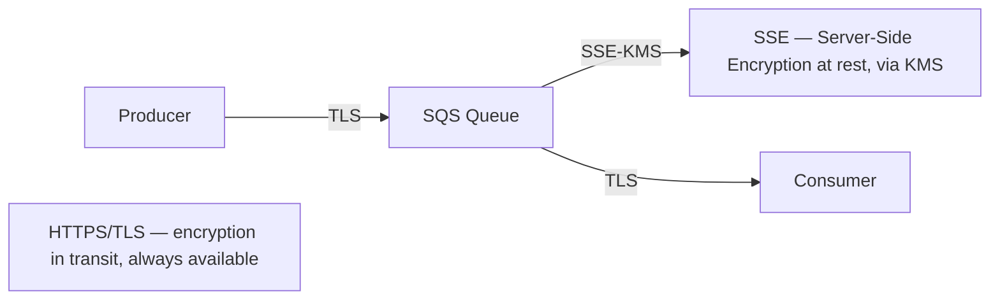

# 42 - SQS Encryption

> Goal: understand SQS's encryption options — the same envelope-encryption/key-tier concepts from this project's [KMS note](../Security-Services/02-AWS-Key-Management-Service-KMS.md), applied specifically to queue messages.

---

## 1. The problem: message contents may be sensitive

A queue's messages might contain personal data, payment details, or other sensitive content — both **in transit** (between producer/consumer and SQS) and **at rest** (while sitting in the queue) need protection.

---

## 2. Architecture & workflow

---

## 3. The two layers

| Layer | How it's handled |
|---|---|
| **In transit** | All SQS API calls happen over **HTTPS/TLS** by default — this isn't optional or separately configured |
| **At rest** | **SSE (Server-Side Encryption)** — enabled per queue, using either an **AWS managed key** (`alias/aws/sqs`, no setup required) or a **customer managed KMS key** (full control over key policy, rotation, and audit trail via CloudTrail) |

---

## 4. Why choose a customer managed key over the AWS managed default

A **customer managed key** lets you control **exactly who can use the key** (separate from who can access the queue itself — the same two-layer permission model this project's KMS note covered for S3), enable **automatic key rotation** on your own schedule, and see **every use of the key** in CloudTrail — genuinely useful for compliance requirements that specifically call out key-level audit trails, not just queue-level access logs.

> 🎯 **Exam tip**: "encrypt queue messages at rest, and specifically need to control and audit who can decrypt them, separately from who can send/receive on the queue" → **SSE with a customer managed KMS key**. If the requirement is just "encrypt at rest" with no specific control/audit need, the simpler AWS managed key is sufficient and requires no extra setup.

---

## 5. Recap

- **In transit** encryption (TLS) is automatic and always on for SQS API calls.
- **At rest** encryption (SSE) is opt-in per queue, using either an AWS managed key (zero setup) or a customer managed KMS key (full control/audit).
- Next: the [SQS Access Policy](43-SQS-Access-Policy.md) note — controlling *who* can send/receive on a queue at all, a separate concern from encryption.

### Sources
- [Amazon SQS server-side encryption — AWS docs](https://docs.aws.amazon.com/AWSSimpleQueueService/latest/SQSDeveloperGuide/sqs-server-side-encryption.html)
