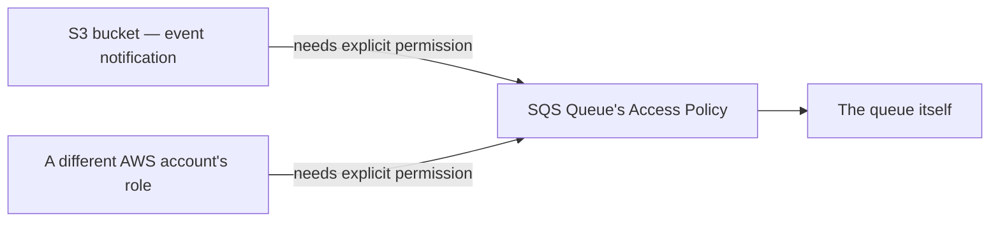

# 43 - SQS Access Policy

> Goal: understand SQS's **resource-based policy** — the mechanism controlling who's allowed to send/receive on a queue at all, distinct from the [encryption](42-SQS-Encryption.md) note's "who can decrypt" concern.

---

## 1. The problem: IAM alone doesn't cover cross-account or cross-service access cleanly

An IAM policy attached to a user/role can grant that identity permission to call SQS actions. But when a **different AWS account**, or an **AWS service** like S3 or SNS, needs to send messages to your queue, a **resource-based policy on the queue itself** is the more direct, standard mechanism — the exact same "resource-based policy" pattern this project has already covered for S3 bucket policies, KMS key policies, and API Gateway resource policies.

---

## 2. Architecture & workflow

---

## 3. What an access policy controls

An SQS access policy is a standard IAM policy document, attached directly to the queue, that can grant:
- **Cross-account access** — letting a specific principal in another AWS account send/receive/manage the queue.
- **AWS service permissions** — e.g. allowing **S3** to call `SendMessage` on the queue as part of an [S3 event notification](54-S3-SQS-Lambda.md), or allowing **SNS** to publish to the queue as part of a fan-out pattern.
- **Fine-grained action scoping** — allow `SendMessage` but not `DeleteQueue`, for example.

> 🧠 Without an explicit access policy statement, **S3's event notifications to SQS silently fail** — this is a genuinely common real-world gotcha: the S3 side looks correctly configured, but nothing arrives, because the queue itself never granted S3 permission to call `SendMessage`.

> 🎯 **Exam tip**: "S3 is configured to send event notifications to an SQS queue, but no messages are appearing" — check the **queue's access policy** first, not the S3 event notification configuration itself, which is very often already correct.

---

## 4. Recap

- The **Access Policy** is a resource-based policy on the queue itself, controlling cross-account and cross-service access — the same pattern as S3 bucket policies and KMS key policies elsewhere in this project.
- A missing access policy statement is the classic, silent reason an otherwise-correctly-configured S3-to-SQS (or SNS-to-SQS) integration doesn't deliver anything.
- Next: the [Hands-On Amazon SQS Lab](44-Hands-On-Amazon-SQS-Lab.md) note — building a real queue and exercising these concepts directly.

### Sources
- [Identity and access management for Amazon SQS — AWS docs](https://docs.aws.amazon.com/AWSSimpleQueueService/latest/SQSDeveloperGuide/sqs-authentication-and-access-control.html)
- [Amazon SQS policy examples — AWS docs](https://docs.aws.amazon.com/AWSSimpleQueueService/latest/SQSDeveloperGuide/sqs-policy-examples.html)
