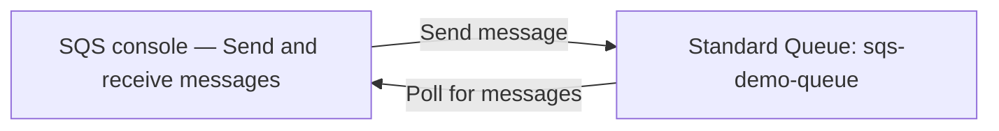

# 44 - Hands-On Amazon SQS Lab

> Goal: build a real Standard queue, send and receive real messages via the console, and directly observe **Visibility Timeout** in action — proving the concepts from the last several notes rather than just reading about them. Entirely via the **AWS Console**.

---

## 1. What you're building

---

## 2. Step 1 — Create the queue

1. **SQS console** → **Create queue**.
2. **Type**: **Standard**.
3. **Name**: `sqs-demo-queue`.
4. **Visibility timeout**: set to **60 seconds** (deliberately longer than default, to make Section 4 easy to observe).
5. Leave other settings at their defaults → **Create queue**.

---

## 3. Step 2 — Send a real message

1. Open `sqs-demo-queue` → **Send and receive messages**.
2. **Message body**: `{"order_id": "demo-001", "item": "widget"}`.
3. **Message attributes** → **Add attribute** → **Name**: `priority`, **Type**: `String`, **Value**: `high`.
4. **Send message**.

---

## 4. Step 3 — Receive it and watch Visibility Timeout in action

1. Still on **Send and receive messages** → **Poll for messages**.
2. Confirm the message appears, with its body and the `priority` attribute both visible.
3. **Without deleting it**, immediately click **Poll for messages** again — confirm the message does **not** reappear, since it's now within its 60-second visibility timeout window from Step 1.
4. Wait 60+ seconds, then **Poll for messages** once more — confirm it **reappears**, direct, observed proof of the [Visibility Timeout](40-SQS-Configuration-Part-2-Visibility-Timeout.md) note's core mechanic: an undeleted message becomes visible again once the timeout expires.

---

## 5. Step 4 — Actually delete it

1. Select the message → **Delete**.
2. **Poll for messages** again → confirm it's genuinely gone this time.

---

## 6. Step 5 — Check the Monitoring tab

1. `sqs-demo-queue` → **Monitoring** tab.
2. Confirm CloudWatch metrics like `NumberOfMessagesSent` and `NumberOfMessagesDeleted` reflect the actions just taken — the same automatic CloudWatch integration covered in this project's [Monitoring](../Monitoring/01-Amazon-CloudWatch-Introduction.md) folder.

---

## 7. Troubleshooting

| Symptom | Likely cause |
|---|---|
| Message reappears immediately, even within the 60-second window | The visibility timeout wasn't actually set to 60 seconds during queue creation — recheck **Queue Actions** → **Edit** |
| **Poll for messages** returns nothing at all | The message may have already been received and is currently hidden by its own visibility timeout — wait for it to expire, or check if it was accidentally deleted already |

---

## 8. Cleanup

1. **SQS console** → delete `sqs-demo-queue`.

---

## 9. Recap

- A message sent to the queue was directly observed becoming **invisible** after being received, then **reappearing** once its visibility timeout expired — the exact mechanic described conceptually in [Visibility Timeout](40-SQS-Configuration-Part-2-Visibility-Timeout.md), now proven live.
- **Message attributes** (the `priority` field) traveled alongside the body as separate, structured metadata.
- Next: the [SQS Dead-Letter Queue (DLQ)](45-SQS-Dead-Letter-Queue-DLQ.md) note — what happens to a message that keeps failing to process successfully.

### Sources
- [Getting started with Amazon SQS — AWS docs](https://docs.aws.amazon.com/AWSSimpleQueueService/latest/SQSDeveloperGuide/sqs-getting-started.html)
- [Sending, receiving, and deleting Amazon SQS messages — AWS docs](https://docs.aws.amazon.com/AWSSimpleQueueService/latest/SQSDeveloperGuide/sqs-send-receive-messages.html)
