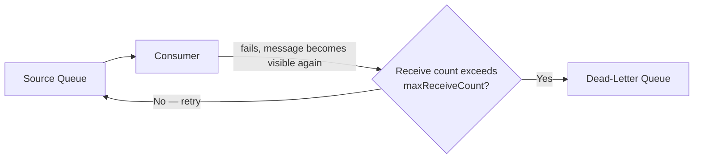

# 45 - SQS Dead-Letter Queue (DLQ)

> Goal: understand what happens to a message that a consumer **keeps failing** to process successfully — without a DLQ, it just cycles forever; with one, it gets isolated for investigation.

---

## 1. The problem: a "poison pill" message can loop forever

If a message is malformed, or triggers a bug every time a consumer tries to process it, the normal SQS cycle (receive → fail → visibility timeout expires → becomes visible again → received again) repeats **indefinitely**. This wastes consumer resources on a message that will never succeed, and can mask the fact that something is actually broken.

---

## 2. Architecture & workflow

---

## 3. How it actually works

1. A **Dead-Letter Queue** is just another **ordinary SQS queue** — there's no special "DLQ" queue type, it's a role you assign to a normal queue.
2. On the **source queue**, configure a **Redrive Policy** pointing to that DLQ, with a **`maxReceiveCount`** — the number of times a message can be received without being deleted before it's automatically moved to the DLQ instead.
3. Once moved, the message stops cycling on the source queue — it now sits in the DLQ, isolated, for manual inspection or automated alerting.

---

## 4. Why this matters

- **Prevents infinite reprocessing loops** on a message that can never succeed.
- **Isolates failures for investigation** — engineers can inspect exactly what's in the DLQ to understand what's going wrong, rather than it being buried in normal queue traffic.
- **A DLQ with messages in it is itself a useful alarm signal** — a CloudWatch alarm on `ApproximateNumberOfMessagesVisible` for the DLQ is a common, genuinely practical pattern for catching processing failures early.

> 🎯 **Exam tip**: "a message keeps being retried and never successfully processes, consuming resources indefinitely" → **Dead-Letter Queue with a Redrive Policy** — this is one of the most reliably tested SQS reliability patterns on the exam.

---

## 5. Recap

- A DLQ is an ordinary queue, assigned the DLQ role via a **Redrive Policy** and **`maxReceiveCount`** on the source queue.
- It isolates messages that repeatedly fail to process, preventing infinite retry loops and giving engineers something concrete to investigate.
- Next: the [SQS Redrive Allow Policy](46-SQS-Redrive-Allow-Policy.md) note — the corresponding safeguard configured on the DLQ's own side.

### Sources
- [Amazon SQS dead-letter queues — AWS docs](https://docs.aws.amazon.com/AWSSimpleQueueService/latest/SQSDeveloperGuide/sqs-dead-letter-queues.html)
