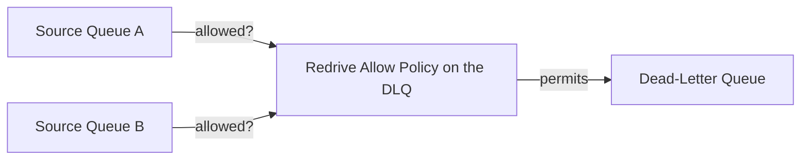

# 46 - SQS Redrive Allow Policy

> Goal: understand the companion setting to the [Dead-Letter Queue](45-SQS-Dead-Letter-Queue-DLQ.md) note's Redrive Policy — configured on the **DLQ itself**, controlling which source queues are actually allowed to use it.

---

## 1. The problem: a DLQ shouldn't silently accept redirected messages from just anywhere

The **Redrive Policy** (previous note) is configured on the *source* queue and says "send my failed messages to this DLQ." Without any check on the DLQ's own side, **any** queue in the account could potentially be configured to redirect failed messages into a given DLQ — not necessarily intentional, and potentially confusing when investigating a DLQ that has messages from an unexpected source.

---

## 2. Architecture & workflow

---

## 3. The three Redrive Allow Policy modes

| Mode | What it does |
|---|---|
| **`allowAll`** (default) | Any source queue in the account can redirect failed messages to this DLQ |
| **`denyAll`** | No source queue can use this DLQ — effectively disables it as a DLQ target |
| **`byQueue`** | Only the **specific source queues you explicitly list** (up to 10) can redirect messages here |

---

## 4. Why `byQueue` matters in practice

For a genuinely intentional, well-organized DLQ strategy — say, a dedicated DLQ per specific workload — `byQueue` prevents an unrelated queue from accidentally (or through a misconfiguration) being pointed at the wrong DLQ, which would otherwise make investigating that DLQ's contents confusing (mixing failures from unrelated systems together).

> 🎯 **Exam tip**: "ensure only a specific set of known source queues can redirect messages into this DLQ" → **Redrive Allow Policy set to `byQueue`**, listing those specific queues — a distinct, DLQ-side control from the source-side Redrive Policy in the previous note.

---

## 5. Recap

- **Redrive Policy** (source queue side) says "send failures here"; **Redrive Allow Policy** (DLQ side) says "I'll only accept failures from these sources."
- `allowAll` (default), `denyAll`, and `byQueue` (an explicit allow-list) are the three modes.
- Next: the [SQS FIFO Deduplication](47-SQS-FIFO-Deduplication.md) note — moving into FIFO-queue-specific mechanics.

### Sources
- [Amazon SQS dead-letter queues — AWS docs](https://docs.aws.amazon.com/AWSSimpleQueueService/latest/SQSDeveloperGuide/sqs-dead-letter-queues.html)
