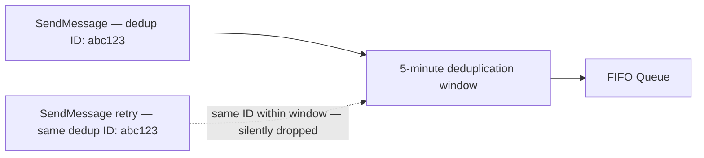

# 47 - SQS FIFO Deduplication

> Goal: understand exactly how a FIFO queue delivers its "exactly-once processing" guarantee from the [Types Of SQS Queues](38-Types-Of-SQS-Queues.md) note — the deduplication mechanism, and the two ways to provide a deduplication ID.

---

## 1. The problem: producers can accidentally (or due to a network retry) send the same message twice

A network hiccup might cause a producer's `SendMessage` call to be retried, even though the first attempt actually succeeded — without deduplication, a FIFO queue would otherwise deliver **two** copies of what was meant to be one message, breaking the "exactly-once" guarantee entirely.

---

## 2. Architecture & workflow

---

## 3. The two ways to deduplicate

| Method | How it works |
|---|---|
| **Content-Based Deduplication** | SQS automatically generates a **SHA-256 hash of the message body** as the deduplication ID — enabled as a queue-level setting, no extra work at send time |
| **Explicit Message Deduplication ID** | The producer provides its own **`MessageDeduplicationId`** value explicitly with each `SendMessage` call — necessary when two messages could have **identical bodies but should still be treated as genuinely different** (content-based hashing would otherwise incorrectly treat them as duplicates) |

---

## 4. The deduplication window

Deduplication only applies within a **5-minute window** — if the *same* deduplication ID is sent again **after** 5 minutes have passed, it's treated as a genuinely new message, not a duplicate.

> 🎯 **Exam tip**: "two messages have identical content but must both be processed as separate, distinct events" is the clearest signal for **explicit `MessageDeduplicationId`** rather than relying on content-based deduplication, since a body-hash approach would incorrectly collapse them into one.

---

## 5. Recap

- FIFO queues deduplicate using either **content-based** (automatic SHA-256 hash of the body) or an **explicit `MessageDeduplicationId`** the producer supplies.
- Deduplication only applies within a **5-minute window** — beyond that, an identical ID is treated as a new message.
- Next: the [SQS Deduplication Scope](48-SQS-Deduplication-Scope.md) note — a related setting controlling *how broadly* deduplication (and ordering) actually applies.

### Sources
- [Exactly-once processing — Amazon SQS docs](https://docs.aws.amazon.com/AWSSimpleQueueService/latest/SQSDeveloperGuide/FIFO-queues-exactly-once-processing.html)
