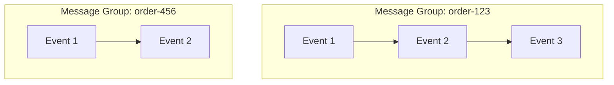

# 48 - SQS Deduplication Scope

> Goal: understand **Message Group ID** and **Deduplication Scope** — the setting that controls whether FIFO ordering/deduplication/throughput apply to the **whole queue** or **per group** within it, directly setting up the [FIFO Throughput Limit](49-FIFO-Throughput-Limit.md) note.

---

## 1. The problem: strict, whole-queue ordering can be more restrictive than actually needed

A FIFO queue's default behavior enforces order across the **entire queue** — but many real workloads don't actually need global ordering, they need ordering **within a specific logical group** (e.g. "all events for order #123 must be in order relative to each other," but different orders don't need to be ordered relative to one another). **Message Group ID** is what expresses that grouping.

---

## 2. Architecture & workflow

Messages within `order-123` stay strictly ordered relative to each other; messages within `order-456` stay strictly ordered relative to each other — but the two groups have no ordering relationship to one another, and can be processed **in parallel**.

---

## 3. Deduplication Scope: queue vs. message group

| Scope | What it means |
|---|---|
| **Queue** (default) | Deduplication (and the related throughput limits) apply across the **entire queue** |
| **Message Group** | Deduplication and throughput apply **per Message Group ID** — enabling higher effective throughput, since different groups are processed independently |

---

## 4. Why this matters for real throughput

Setting deduplication scope to **Message Group**, combined with **High Throughput Mode** (covered in the [FIFO Throughput Limit](49-FIFO-Throughput-Limit.md) note), is specifically what unlocks FIFO's higher throughput ceiling — without it, the whole queue is bottlenecked by the standard, more conservative per-queue limits.

> 🎯 **Exam tip**: "different logical entities (e.g. different customer orders) need strict internal ordering, but don't need to be ordered relative to each other, and we need higher throughput" → use distinct **Message Group IDs** with **Deduplication Scope: Message Group** — this is the standard way to scale a FIFO queue horizontally while still preserving the ordering guarantee where it actually matters.

---

## 5. Recap

- **Message Group ID** scopes strict ordering to a logical group, not the whole queue — different groups can process in parallel.
- **Deduplication Scope** determines whether dedup/throughput limits apply queue-wide or per-group — per-group is what enables higher real throughput.
- Next: the [FIFO Throughput Limit](49-FIFO-Throughput-Limit.md) note — the actual numbers this setting affects.

### Sources
- [FIFO throughput quotas — Amazon SQS docs](https://docs.aws.amazon.com/AWSSimpleQueueService/latest/SQSDeveloperGuide/quotas-messages.html)
