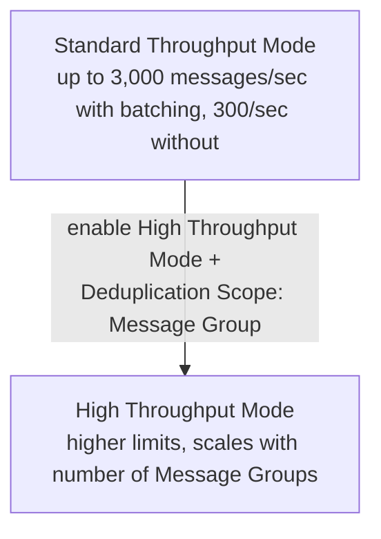

# 49 - FIFO Throughput Limit

> Goal: pin down the actual numbers behind FIFO's throughput ceiling from the [Types Of SQS Queues](38-Types-Of-SQS-Queues.md) note, and how [Deduplication Scope](48-SQS-Deduplication-Scope.md) and batching change them.

---

## 1. The two throughput tiers

| Mode | Throughput |
|---|---|
| **Standard throughput mode** (default) | Up to **300** messages/second without batching, or up to **3,000** messages/second **with batching** (10 messages per `SendMessageBatch`/`ReceiveMessageBatch`/`DeleteMessageBatch` call) |
| **High throughput mode** | A meaningfully higher ceiling, achieved by processing different **Message Groups** in parallel — requires **Deduplication Scope: Message Group** (from the previous note) to actually be enabled |

---

## 2. Why batching alone gets you to 3,000/sec

Each of SQS's batch APIs (`SendMessageBatch`, etc.) can carry **up to 10 messages per call** — so hitting the per-call rate limit while batching effectively multiplies the achievable message throughput by up to 10x compared to sending messages one at a time.

---

## 3. Why High Throughput Mode needs Message Group-scoped deduplication

FIFO's ordering guarantee is fundamentally a **per-Message-Group** guarantee, not a global one (as the previous note covered) — High Throughput Mode is able to offer higher limits specifically *because* it can process **different groups in parallel**, and that parallelism only works safely if deduplication is also scoped per-group rather than checked against the whole queue at once.

> 🎯 **Exam tip**: "we need to scale a FIFO queue's throughput beyond the standard 3,000 messages/second batched limit" → enable **High Throughput Mode** with **Deduplication Scope: Message Group**, and ensure the workload actually uses **multiple distinct Message Group IDs** — High Throughput Mode can't help a workload that only ever uses one single group, since there'd be nothing to parallelize.

---

## 4. Recap

- Standard FIFO throughput: **300/sec** unbatched, **3,000/sec** batched (10 messages per batch call).
- **High Throughput Mode** raises this further, but only works in combination with **Message Group-scoped deduplication** and genuinely multiple Message Groups in use.
- Next: the [FIFO Queue Hands-On Lab](50-FIFO-Queue-Hands-On-Lab.md) note — building a real FIFO queue and proving its ordering guarantee directly.

### Sources
- [FIFO throughput quotas — Amazon SQS docs](https://docs.aws.amazon.com/AWSSimpleQueueService/latest/SQSDeveloperGuide/quotas-messages.html)
- [High throughput for FIFO queues — AWS docs](https://docs.aws.amazon.com/AWSSimpleQueueService/latest/SQSDeveloperGuide/high-throughput-fifo.html)
